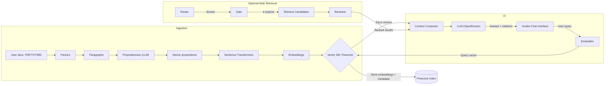
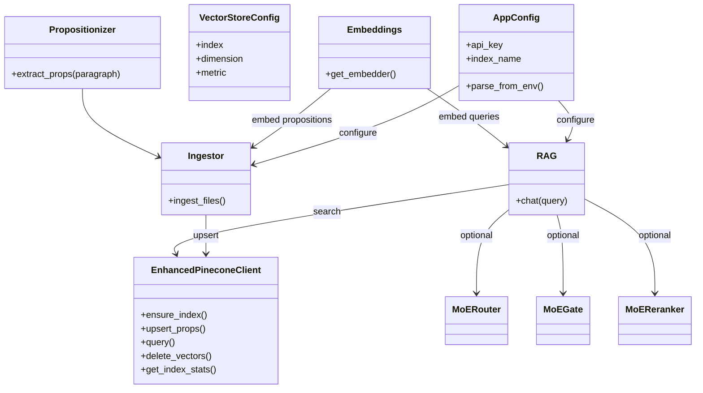
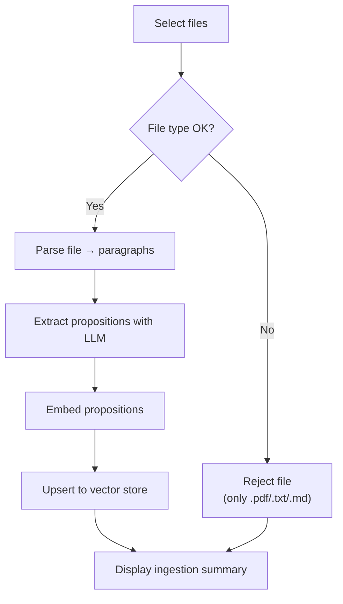
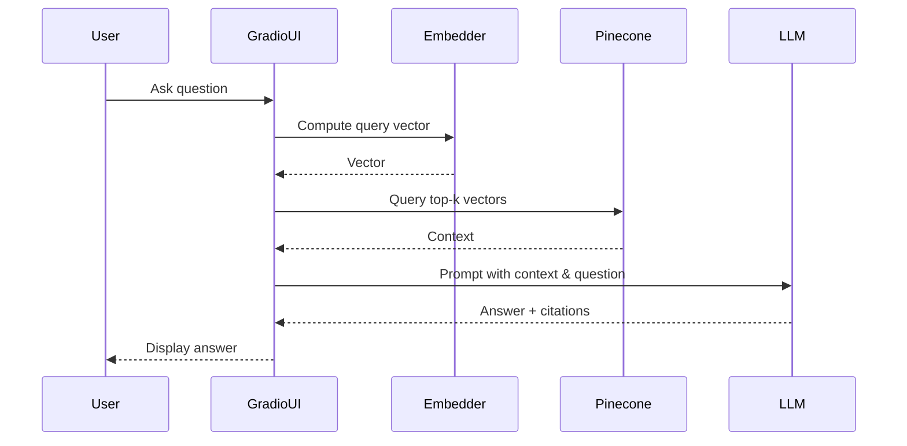
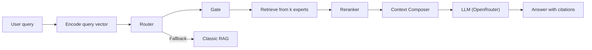

<!-- [Unverified] Converted to GitHub-Flavored Markdown; technical claims not independently verified. -->

<!-- Decorative header image for the README.
     Replace the path below with your repo path (e.g., ./assets/readme-header.png). -->
<p align="center">
  
</p>

# Personal Propositional RAG Chatbot (Prototype)

> A local-first personal research assistant that ingests PDF/TXT/MD documents, extracts atomic propositions, stores them in a vector database, and answers questions with precise citations—running privately on your machine.

**Tech:** Python · Gradio · Pinecone · MIT License

---

## 🔍 Quick Reference

This prototype implements a local retrieval-augmented generation (RAG) system focused on propositions. It parses documents into paragraphs, generates atomic facts via an LLM “propositionizer,” embeds them using Sentence-Transformers, stores vectors in a Pinecone index, and delivers answers with context-rich citations.

**Security:** only `.pdf`, `.txt`, and `.md` files up to **10 MB** are accepted.

### Key Features

- **📄 Document ingestion pipeline** — Parse PDFs/TXT/MD, extract propositions with an LLM, encode with Sentence-Transformers, and upsert into Pinecone.
- **💬 Chat interface** — Gradio 5.x single-page UI with SSR and PWA support.
- **🔍 Retrieval & answering** — Embed query, similarity search, top-k filtering, and generate an answer with citations.
- **💸 Cost awareness** — Real-time display of LLM usage and token counts.
- **📊 Evaluation harness** — Retrieval metrics: hit@k, nDCG, and citation span accuracy.
- **🧠 (Optional) MoE retrieval** — Router, gate, and two-stage reranker for hybrid retrieval.

---

## 🧰 Technologies

| Category            | Technology / Version Hint            |
|---------------------|--------------------------------------|
| Programming Language| Python ≥ 3.11                        |
| UI Framework        | Gradio ≥ 5.4x                        |
| Vector Database     | Pinecone ≥ 7.x                       |
| Embeddings          | Sentence-Transformers 5.x            |
| ML Runtime          | PyTorch ≥ 2.x                        |
| PDF Parser          | `pypdf` ≥ 6.x                        |
| LLM API             | OpenRouter `/chat/completions`       |

**Local URL:** `http://localhost:7860` after starting the app.

---

## 🗺 Visual Architecture Overview

### High-Level System Architecture

```mermaid
flowchart LR
  subgraph ING["Ingestion"]
    A["User docs: PDF/TXT/MD"] --> B[Parsers]
    B --> C[Paragraphs]
    C --> D["Propositionizer (LLM)"]
    D --> E["Atomic propositions"]
    E --> F["Sentence-Transformers"]
    F --> G[Embeddings]
    G --> H{"Vector DB: Pinecone"}
  end

  subgraph UI["UI"]
    U["Gradio Chat Interface"] -->|"User query"| V[Embedder]
    V -->|"Query vector"| H
    H -->|"Top-k vectors"| W["Context Composer"]
    W --> X["LLM (OpenRouter)"]
    X -->|"Answer + citations"| U
  end

  subgraph MOE["Optional MoE Retrieval"]
    R[Router] -->|"Scores"| G1[Gate]
    G1 -->|"k experts"| RT["Retrieve Candidates"]
    RT --> S[Reranker]
    S -->|"Ranked results"| W
  end

  H -->|"Store embeddings + metadata"| VS[(Pinecone Index)]
```

### Core Classes & Modules


```mermaid
classDiagram
  class AppConfig {
    +api_key
    +index_name
    +parse_from_env()
  }
  class VectorStoreConfig {
    +index
    +dimension
    +metric
  }
  class EnhancedPineconeClient {
    +ensure_index()
    +upsert_props()
    +query()
    +delete_vectors()
    +get_index_stats()
  }
  class Propositionizer {
    +extract_props(paragraph)
  }
  class Embeddings {
    +get_embedder()
  }
  class Ingestor {
    +ingest_files()
  }
  class RAG {
    +chat(query)
  }
  class MoERouter { }
  class MoEGate { }
  class MoEReranker { }

  AppConfig --> Ingestor : configure
  AppConfig --> RAG : configure
  Embeddings --> RAG : embed queries
  Embeddings --> Ingestor : embed propositions
  Propositionizer --> Ingestor
  Ingestor --> EnhancedPineconeClient : upsert
  RAG --> EnhancedPineconeClient : search
  RAG --> MoERouter : optional
  RAG --> MoEGate : optional
  RAG --> MoEReranker : optional
```

### Ingestion Process Flow


```mermaid
flowchart TD
  A[Select files] --> B{File type OK?}
  B -->|Yes| C[Parse file → paragraphs]
  B -->|No| Z["Reject file
(only .pdf/.txt/.md)"]
  C --> D[Extract propositions with LLM]
  D --> E[Embed propositions]
  E --> F[Upsert to vector store]
  F --> G[Display ingestion summary]
  Z --> G
```

### Retrieval & Answering (Classic RAG)


```mermaid
sequenceDiagram
  participant User
  participant UI as GradioUI
  participant Embedder
  participant VectorDB as Pinecone
  participant LLM
  User->>UI: Ask question
  UI->>Embedder: Compute query vector
  Embedder-->>UI: Vector
  UI->>VectorDB: Query top-k vectors
  VectorDB-->>UI: Context
  UI->>LLM: Prompt with context & question
  LLM-->>UI: Answer + citations
  UI-->>User: Display answer
```

### Retrieval & Answering with MoE (Experimental)


```mermaid
flowchart LR
  Q["User query"] --> E1["Encode query vector"]
  E1 --> M1[Router]
  M1 --> G1[Gate]
  G1 --> R1["Retrieve from k experts"]
  R1 --> RR[Reranker]
  RR --> C1["Context Composer"]
  C1 --> G2["LLM (OpenRouter)"]
  G2 --> A1["Answer with citations"]
  M1 -->|"Fallback"| V1["Classic RAG"]
```

---

## 🚀 Installation

**Prerequisites:** Windows 10/11 with PowerShell ≥ 5.1, Python 3.11+, ≥ 4 GB RAM. Pinecone and OpenRouter accounts required.

```bash
git clone https://github.com/JackSmack1971/personal-rag-propo.git
cd personal-rag-propo
python -m venv .venv

# Windows
.venv\Scriptsctivate
# Linux/Mac
# source .venv/bin/activate

pip install -r requirements.txt
```

Create `.env` in project root (or copy `.env.example`):

```env
OPENROUTER_API_KEY=your_openrouter_key
PINECONE_API_KEY=your_pinecone_key
PINECONE_INDEX_NAME=personal-rag
MODEL_NAME=gpt-3.5-turbo
MOE_ENABLED=false
```

Run the app:

```bash
python src/app.py
# UI → http://localhost:7860
```

**Troubleshooting**

- *Failed to parse file:* Ensure file is PDF/TXT/MD and under 10 MB.
- *Vector index not found:* Verify `PINECONE_INDEX_NAME` in your Pinecone dashboard.
- *MoE errors:* Set `MOE_ENABLED=false` for classic RAG, or adjust `moe/config.py`.

---

## 🧑‍💻 Usage

Programmatic ingestion & chat:

```python
from src.ingest import ingest_files
from src.embeddings import get_embedder
from src.vectorstore import ensure_index, EnhancedPineconeClient
from src.rag import rag_chat
from src.config import AppConfig

config = AppConfig.from_env()
index = ensure_index(
    config.pinecone_api_key,
    config.pinecone_env,
    config.pinecone_index_name
)
client = EnhancedPineconeClient(index)
embedder = get_embedder(config)

ingest_files(["docs/manual.pdf", "notes.md"], embedder, client)

answer = rag_chat("What is the main goal of this project?", config)
print(answer)
```

---

## ⚙️ Configuration

Key environment-driven settings (see `src/config.py` and `src/moe/config.py`):

| Parameter              | Description                         | Default                                   |
|------------------------|-------------------------------------|-------------------------------------------|
| `OPENROUTER_API_KEY`   | API key for LLM completions         | **required**                               |
| `PINECONE_API_KEY`     | API key for Pinecone index          | **required**                               |
| `PINECONE_INDEX_NAME`  | Name of vector index                | `personal-rag`                             |
| `EMBEDDING_MODEL_NAME` | Sentence-Transformer model          | `sentence-transformers/all-MiniLM-L6-v2`   |
| `TOP_K`                | Retrieval top-k                     | `6`                                        |
| `MOE_ENABLED`          | Enable MoE retrieval                | `false`                                    |
| `MOE_TOP_K_EXPERTS`    | Number of experts to select         | `2`                                        |
| `MAX_FILE_SIZE_MB`     | Max upload size                     | `10`                                       |

**API entry points**

- `ingest_files(files, embedder, client)` — parse & ingest documents.
- `rag_chat(query, config)` — retrieval-augmented chat.
- `rag_chat_with_moe(query, config)` — chat with MoE retrieval.
- `EnhancedPineconeClient.*` — upserts, queries, and index management.

---

## 📁 Project Structure

```
personal-rag-propo/
├── src/
│   ├── app.py                # Gradio UI & server
│   ├── config.py             # Configuration dataclass
│   ├── ingest.py             # File ingestion pipeline
│   ├── rag.py                # RAG logic
│   ├── embeddings.py         # Embedding model loading
│   ├── vectorstore.py        # Pinecone client wrapper
│   ├── propositionizer.py    # Proposition extraction via LLM
│   ├── security.py           # Input validation & rate limiting
│   ├── auth.py               # Authentication & session management
│   ├── moe/
│   │   ├── config.py         # MoE configuration parameters
│   │   ├── router.py         # Expert routing
│   │   ├── gate.py           # Adaptive retrieval gate
│   │   └── reranker.py       # Reranking algorithms
│   └── eval/                 # Evaluation harness and metrics
├── docs/                     # Supplementary documentation
├── memory-bank/              # Indexed embeddings & metadata (git-ignored)
├── scripts/                  # Utility scripts (e.g., evaluation)
├── AGENTS.md                 # Guide for RAG agents
├── PRD.md                    # Product Requirements Document
├── requirements.txt          # Python dependencies
├── .env.example              # Example environment variables
└── LICENSE                   # MIT License
```

---

## 🛠 Development

- **Environment:** Create venv, install deps, configure `.env`. Avoid committing secrets.
- **Quality:** `ruff check .` and `black .` for style/formatting.
- **Tests:** `pytest` (see `tests/`).
- **Evaluation:** `python scripts/run_eval.py --top_k 6`.
- **CI:** Configure GitHub Actions to run lint/tests on PRs.
- **Contributing:** Open issue → feature branch → tests/docs → PR (must pass CI).
- **Style:** PEP 8 + Black; type hints encouraged.

---

## 📄 Additional Docs

- **Product Requirements:** `PRD.md`
- **Agents Guide:** `AGENTS.md`
- **Security:** `src/security.py` (validation, rate limits, file restrictions)
- **Mixture of Experts:** `src/moe/` (router, gate, reranker)
- **Evaluation Harness:** `src/eval/` and `scripts/` (hit@k, nDCG@k, citation span accuracy)

---

## ❓ FAQ

<details>
<summary>Can I run this on Linux or Mac?</summary>
Yes. While the prototype targets Windows, the code is platform-agnostic. Adjust the venv activation command for your OS.
</details>

<details>
<summary>Does this work offline?</summary>
Parsing, embedding, and index storage are local. LLM responses and Pinecone operations require internet access and valid API keys.
</details>

<details>
<summary>How do I clear the vector index?</summary>
Use `EnhancedPineconeClient.delete_vectors(ids)` to delete specific vectors, or recreate the index via the Pinecone dashboard.
</details>

---

## 📜 License

MIT — see `LICENSE`.
