# Personal RAG Proposition System 🤖📚

[](https://opensource.org/licenses/MIT)
[](https://www.python.org/downloads/)
[](https://gradio.app/)
[](https://www.pinecone.io/)
[]()
[]()

> **Advanced Personal Knowledge Assistant with Mixture-of-Experts Retrieval**

A production-ready, local-first retrieval-augmented generation (RAG) system that transforms your personal documents into an intelligent, citation-precise chatbot. Built with cutting-edge 2025 technology stack featuring advanced proposition extraction, multi-backend embeddings, and optional Mixture-of-Experts architecture.

---

## 🚀 Quick Start

**Get up and running in under 5 minutes:**

```bash
# 1. Clone and setup
git clone https://github.com/JackSmack1971/personal-rag-propo.git
cd personal-rag-propo
python -m venv venv && source venv/bin/activate  # Windows: .\venv\Scripts\activate

# 2. Install dependencies
pip install -r requirements-2025.txt

# 3. Configure environment
cp .env.example .env
# Edit .env with your OpenRouter and Pinecone API keys

# 4. Launch application
python app.py
```

**📖 [Jump to Installation Guide](#-installation-guide) for detailed setup instructions**

---

## 🎯 Core Features

### **🔥 2025 Enhanced Features**
- **⚡ 4x Performance Boost**: OpenVINO quantization with multi-backend support (torch/onnx/openvino)
- **🧠 Advanced MoE Architecture**: Mixture-of-Experts retrieval with intelligent routing and reranking
- **🛡️ Enterprise Security**: RAG poisoning detection, OWASP LLM Top 10 compliance, comprehensive threat modeling
- **📱 Modern PWA Interface**: Gradio 5.x with SSR, mobile optimization, and production-ready deployment
- **📊 Real-time Analytics**: Cost monitoring, performance tracking, and A/B testing capabilities

### **📚 Intelligent Document Processing**
- **Multi-format Support**: PDF, TXT, MD with advanced parsing and error recovery
- **Atomic Proposition Extraction**: LLM-powered breakdown of complex documents into verifiable facts
- **Precision Citations**: Character-level source attribution with confidence scoring
- **Batch Processing**: Efficient handling of large document collections

### **🔍 Advanced Retrieval System**
- **Hybrid Search**: Dense + sparse embeddings for superior recall and precision
- **Dynamic Thresholding**: Adaptive similarity scoring based on query complexity
- **Multi-stage Reranking**: Cross-encoder refinement for optimal result ordering
- **Contextual Filtering**: Intelligent context composition with relevance optimization

---

## 🏗️ System Architecture

### High-Level Architecture Overview


### Document Ingestion Flow

```mermaid
flowchart TD
    START([Document Upload]) --> VALIDATE{Security Validation}
    VALIDATE -->|✓ Safe| PARSE[Multi-format Parser]
    VALIDATE -->|✗ Threat Detected| BLOCK[Block & Alert]
    
    PARSE --> EXTRACT[Extract Text Content]
    EXTRACT --> CLEAN[Clean & Normalize]
    CLEAN --> CHUNK[Intelligent Chunking]
    CHUNK --> PROP[LLM Proposition Extraction]
    
    PROP --> EMBED[Generate Embeddings]
    EMBED --> BACKEND{Backend Selection}
    BACKEND -->|CPU| OPENVINO[OpenVINO Quantized]
    BACKEND -->|GPU| TORCH[PyTorch CUDA]
    BACKEND -->|Balanced| ONNX[ONNX Runtime]
    
    OPENVINO --> VECTORIZE[Create Vectors]
    TORCH --> VECTORIZE
    ONNX --> VECTORIZE
    
    VECTORIZE --> METADATA[Enrich Metadata]
    METADATA --> UPSERT[Pinecone Upsert]
    UPSERT --> INDEX[(Vector Index)]
    INDEX --> SUCCESS([✓ Document Indexed])
    
    BLOCK --> FAIL([✗ Processing Failed])
    
    style START fill:#4caf50
    style SUCCESS fill:#4caf50
    style FAIL fill:#f44336
    style PROP fill:#ff9800
    style EMBED fill:#2196f3
```



### RAG Query Processing Pipeline


### MoE Architecture Details


### Component Interaction Map


---

## 📦 Installation Guide

### Prerequisites

Before installation, ensure your system meets these requirements:

| Requirement | Minimum | Recommended | Notes |
|-------------|---------|-------------|--------|
| **Python** | 3.10+ | 3.11+ | Type hints and performance optimizations |
| **RAM** | 8GB | 16GB | 20% increase with MoE architecture |
| **Storage** | 10GB | 20GB | Model cache and document storage |
| **CPU** | 4 cores | 8 cores | Multi-backend processing support |
| **GPU** | Optional | RTX 3060+ | 4x performance improvement with OpenVINO |

### Required API Keys

You'll need accounts and API keys for:

- **[OpenRouter](https://openrouter.ai/)**: Access to 100+ language models
- **[Pinecone](https://www.pinecone.io/)**: Serverless vector database

### Step-by-Step Installation

#### 1. Clone the Repository

```bash
git clone https://github.com/JackSmack1971/personal-rag-propo.git
cd personal-rag-propo
```

#### 2. Create Virtual Environment

<details>
<summary>Windows (PowerShell)</summary>

```powershell
python -m venv venv
.\venv\Scripts\Activate.ps1
```

</details>

<details>
<summary>macOS/Linux</summary>

```bash
python3 -m venv venv
source venv/bin/activate
```

</details>

#### 3. Install Dependencies

```bash
# Install 2025 enhanced dependencies
pip install --upgrade pip
pip install -r requirements-2025.txt

# Optional: Install development dependencies
pip install -r requirements-dev.txt
```

#### 4. Configure Environment

```bash
# Copy environment template
cp .env.example .env

# Edit configuration file
nano .env  # or your preferred editor
```

**Required Environment Variables:**

```env
# API Keys (Required)
OPENROUTER_API_KEY=your_openrouter_api_key_here
PINECONE_API_KEY=your_pinecone_api_key_here

# Core Configuration
PINECONE_INDEX=personal-rag
EMBED_MODEL=BAAI/bge-small-en-v1.5
NAMESPACE=default
TOP_K=6

# 2025 Stack Features
GRADIO_SSR_ENABLED=true
PINECONE_GRPC_ENABLED=true
SENTENCE_TRANSFORMERS_BACKEND=torch

# Optional: MoE Architecture
MOE_ENABLED=false  # Set to true to enable advanced retrieval
```

#### 5. Initialize Pinecone Index

The application will automatically create the required Pinecone index on first run, but you can manually initialize it:

```bash
python -c "
from src.config import Config
from src.vectorstore import ensure_index_exists
cfg = Config()
ensure_index_exists(cfg, dim=384)
print('✅ Pinecone index initialized successfully')
"
```

#### 6. Launch Application

```bash
# Start the application
python app.py

# Alternative: Launch with specific configuration
python app.py --config config/production.yaml
```

The application will be available at `http://localhost:7860`

### Verification Steps

1. **✅ Basic Functionality**: Upload a test document and ask a question
2. **✅ API Connectivity**: Verify OpenRouter and Pinecone connections in logs
3. **✅ Performance**: Check embedding generation and retrieval speed
4. **✅ Security**: Confirm security validation is active

---

## 💻 Usage Guide

### Web Interface

#### Document Management Tab

1. **Upload Documents**: Drag and drop PDF/TXT/MD files
2. **Monitor Processing**: Real-time progress with detailed status
3. **Review Extractions**: Inspect extracted propositions
4. **Manage Index**: View indexed documents and statistics

#### Chat Interface Tab

1. **Ask Questions**: Natural language queries about your documents
2. **Review Responses**: Comprehensive answers with precise citations
3. **Explore Sources**: Click citations to view original context
4. **Export Conversations**: Save chat history in multiple formats

#### Advanced Configuration Tab

1. **Model Selection**: Choose embedding and LLM models
2. **Performance Tuning**: Adjust retrieval parameters
3. **MoE Settings**: Configure expert routing and reranking
4. **Security Options**: Enable threat detection and monitoring

### Programmatic Usage

#### Basic RAG Pipeline

```python
from src.config import Config
from src.rag import RAGPipeline
from src.ingest import DocumentIngestor

# Initialize components
config = Config()
rag = RAGPipeline(config)
ingestor = DocumentIngestor(config)

# Ingest documents
documents = ["path/to/document1.pdf", "path/to/document2.txt"]
for doc_path in documents:
    result = ingestor.ingest_file(doc_path)
    print(f"✅ Ingested: {result.document_id}")

# Ask questions
query = "What are the key findings about machine learning?"
response = rag.answer_question(query)

print(f"Answer: {response.answer}")
print(f"Sources: {[s.source for s in response.citations]}")
```

#### Advanced MoE Configuration

```python
from src.config import Config, MoEConfig
from src.moe.router import ExpertRouter
from src.moe.gate import SelectiveGate

# Configure MoE architecture
moe_config = MoEConfig(
    enabled=True,
    experts=["technical", "general", "personal"],
    router_config={
        "centroid_refresh_interval": 3600,
        "similarity_threshold": 0.7
    },
    gate_config={
        "retrieve_threshold": 0.62,
        "adaptive_k": True
    }
)

config = Config(moe=moe_config)
rag = RAGPipeline(config)

# MoE-enhanced retrieval
query = "Explain quantum computing applications"
response = rag.answer_question(query, use_moe=True)
```

### Cost Management

#### Monitor Usage and Costs

1. Navigate to "Cost Estimation" tab
2. Input expected monthly queries
3. Adjust token usage parameters
4. Get projected monthly costs with breakdown

#### Optimize Performance and Costs

```python
# Configure model and result caching
config.ENABLE_MODEL_CACHING = True
config.ENABLE_RESULT_CACHING = True
config.CACHE_TTL_SECONDS = 3600

# Use cost-efficient models
config.EMBED_MODEL = "BAAI/bge-small-en-v1.5"  # Fast and cost-effective
config.LLM_MODEL = "openrouter/auto"  # Auto-select optimal model

# Batch processing for large collections
from src.batch_processing import BatchProcessor
processor = BatchProcessor(config)
results = processor.process_directory("documents/", batch_size=10)
```

---

## 📁 Project Structure

```
personal-rag-propo/
├── 📄 app.py                          # Main Gradio application entry point
├── 📄 requirements-2025.txt           # Enhanced 2025 dependency specifications
├── 📄 .env.example                    # Environment configuration template
├── 📄 README.md                       # This comprehensive documentation
├── 📄 AGENTS.md                       # AI collaboration guide
├── 📄 CONTRIBUTING.md                 # Contribution guidelines
├── 📄 LICENSE                         # MIT license
│
├── 📂 src/                            # Core application modules
│   ├── 📄 config.py                   # Enhanced configuration with YAML support
│   ├── 📄 embeddings.py               # Multi-backend embeddings (torch/onnx/openvino)
│   ├── 📄 vectorstore.py              # Pinecone 7.x with gRPC integration
│   ├── 📄 rag.py                      # RAG pipeline with MoE integration
│   ├── 📄 ingest.py                   # Document ingestion orchestration
│   ├── 📄 parsers.py                  # Multi-format document parsers
│   ├── 📄 propositionizer.py          # LLM-based atomic fact extraction
│   ├── 📄 monitoring.py               # Cost tracking and performance metrics
│   ├── 📄 security.py                 # Security validation and hardening
│   ├── 📄 cache.py                    # Intelligent caching system
│   ├── 📄 batch_processing.py         # Efficient batch operations
│   │
│   ├── 📂 moe/                        # Mixture of Experts implementation
│   │   ├── 📄 __init__.py              # MoE package initialization
│   │   ├── 📄 config.py                # MoE-specific configuration
│   │   ├── 📄 router.py                # Expert routing with centroid management
│   │   ├── 📄 gate.py                  # Selective retrieval gating
│   │   ├── 📄 rerank.py                # Two-stage reranking pipeline
│   │   └── 📄 evaluation.py            # MoE performance monitoring
│   │
│   └── 📂 eval/                       # Evaluation and testing framework
│       ├── 📄 eval.py                  # Comprehensive evaluation metrics
│       ├── 📄 benchmarks.py            # Performance benchmarking
│       └── 📄 test_datasets.py         # Test dataset management
│
├── 📂 docs/                           # Comprehensive documentation
│   ├── 📂 runbooks/                   # Operational runbooks
│   ├── 📂 specifications/             # Technical specifications
│   ├── 📂 research/                   # Research and implementation guides
│   └── 📂 factcheck/                  # Implementation readiness validation
│
├── 📂 tests/                          # Comprehensive test suite
│   ├── 📄 test_integration.py          # Integration testing
│   ├── 📄 test_performance.py          # Performance testing
│   ├── 📄 test_security.py             # Security testing
│   └── 📂 unit/                        # Unit tests for all modules
│
├── 📂 config/                         # Configuration templates
│   ├── 📄 development.yaml             # Development environment config
│   ├── 📄 production.yaml              # Production environment config
│   └── 📄 security-templates.yaml      # Security configuration templates
│
└── 📂 scripts/                        # Utility and deployment scripts
    ├── 📄 setup.sh                     # Initial setup script
    ├── 📄 deploy.sh                    # Deployment automation
    ├── 📄 backup.sh                    # Backup and recovery
    └── 📄 cleanup-repo.ps1             # Repository maintenance
```

---

## 🔧 Development Guide

### Development Environment Setup

#### Local Development

```bash
# Clone and setup development environment
git clone https://github.com/JackSmack1971/personal-rag-propo.git
cd personal-rag-propo

# Install development dependencies
pip install -r requirements-dev.txt

# Configure pre-commit hooks
pre-commit install

# Run in development mode
export ENVIRONMENT=development
python app.py --debug
```

#### Docker Development

```bash
# Build development container
docker build -f Dockerfile.dev -t personal-rag-dev .

# Run with hot reloading
docker run -p 7860:7860 -v $(pwd):/app personal-rag-dev
```

### Code Quality Standards

#### Automated Quality Checks

```bash
# Format code
black src/ tests/
isort src/ tests/

# Lint and security checks
flake8 src/ tests/
bandit -r src/
mypy src/

# Run comprehensive tests
pytest --cov=src --cov-report=html
```

#### Contribution Workflow

1. **Fork Repository**: Create personal fork on GitHub

2. **Create Feature Branch**:
   ```bash
   git checkout -b feature/your-feature-name
   ```

3. **Implement Changes**:
   - Follow existing code patterns and architecture
   - Add comprehensive type hints and docstrings
   - Include unit tests for new functionality

4. **Run Quality Checks**:
   ```bash
   # Lint and format code
   black src/ tests/
   flake8 src/ tests/
   isort src/ tests/
   
   # Run security scan
   bandit -r src/
   
   # Run tests
   pytest
   ```

5. **Submit Pull Request**:
   - Include clear description of changes
   - Link to relevant issues or specifications
   - Ensure all CI checks pass

### Testing Strategy

#### Unit Tests

```python
# Example: Testing embedding functionality
import pytest
from src.embeddings import EmbeddingEngine
from src.config import Config

def test_embedding_generation():
    config = Config()
    engine = EmbeddingEngine(config)
    
    text = "This is a test document"
    embedding = engine.embed_text(text)
    
    assert embedding is not None
    assert len(embedding) == 384  # BGE-small dimension
    assert isinstance(embedding, np.ndarray)

def test_batch_embedding_efficiency():
    engine = EmbeddingEngine(config)
    texts = ["Text 1", "Text 2", "Text 3"]
    
    # Batch should be more efficient than individual
    start_time = time.time()
    batch_embeddings = engine.embed_batch(texts)
    batch_time = time.time() - start_time
    
    start_time = time.time()
    individual_embeddings = [engine.embed_text(text) for text in texts]
    individual_time = time.time() - start_time
    
    assert batch_time < individual_time
```

#### Integration Tests

```python
# Example: End-to-end RAG pipeline test
def test_full_rag_pipeline():
    config = Config()
    rag = RAGPipeline(config)
    
    # Ingest test document
    test_doc = "test_data/sample_document.pdf"
    ingest_result = rag.ingest_document(test_doc)
    assert ingest_result.success
    
    # Query the document
    query = "What is the main topic discussed?"
    response = rag.answer_question(query)
    
    assert response.answer is not None
    assert len(response.citations) > 0
    assert response.confidence > 0.5
```

---

## 🛡️ Security & Privacy

### Security Architecture

#### Multi-Layer Security Model


### Security Features

#### RAG Poisoning Protection

- **Content Validation**: Multi-layer document scanning for malicious content
- **Query Analysis**: Detection of prompt injection attempts
- **Response Filtering**: Output sanitization and safety checks
- **Anomaly Detection**: Behavioral pattern analysis for unusual activities

#### Data Privacy Controls

- **Local Processing**: Documents processed locally when possible
- **Encryption**: End-to-end encryption for all data transmission
- **Access Controls**: Role-based permissions and authentication
- **Data Retention**: Configurable retention policies with automatic cleanup

#### Security Configuration

```python
# Enable comprehensive security features
from src.security import SecurityManager

security = SecurityManager(config)

# Configure RAG poisoning detection
security.enable_rag_poisoning_detection(
    content_scanning=True,
    query_analysis=True,
    response_filtering=True,
    anomaly_detection=True
)

# Setup access controls
security.configure_authentication(
    method="oauth2",
    providers=["google", "github"],
    session_timeout=3600
)

# Enable audit logging
security.enable_audit_logging(
    level="comprehensive",
    retention_days=90,
    encryption=True
)
```

---

## 📊 Performance & Monitoring

### Performance Optimization

#### Multi-Backend Support

The system automatically selects the optimal backend based on hardware:

| Backend | Use Case | Performance | Memory |
|---------|----------|-------------|--------|
| **OpenVINO** | CPU inference | 4x faster | 40% less |
| **PyTorch** | GPU acceleration | Baseline | Baseline |
| **ONNX** | Balanced performance | 2x faster | 20% less |

#### Caching Strategy

```python
# Intelligent multi-level caching
from src.cache import CacheManager

cache = CacheManager(config)

# Model caching with backend-specific keys
cache.enable_model_caching(
    backends=["openvino", "torch", "onnx"],
    memory_limit="4GB",
    disk_cache=True
)

# Result caching with TTL
cache.enable_result_caching(
    ttl_seconds=3600,
    max_entries=10000,
    compression=True
)

# Query caching for repeated questions
cache.enable_query_caching(
    similarity_threshold=0.95,
    ttl_seconds=1800
)
```

### Monitoring Dashboard

#### Key Performance Metrics


#### Real-time Monitoring

```python
from src.monitoring import PerformanceMonitor, CostTracker

# Initialize monitoring
monitor = PerformanceMonitor(config)
cost_tracker = CostTracker(config)

# Real-time metrics collection
@monitor.track_performance
def process_query(query: str) -> str:
    # RAG processing logic
    response = rag.answer_question(query)
    
    # Track costs
    cost_tracker.log_api_usage(
        provider="openrouter",
        tokens_used=response.token_count,
        cost=response.estimated_cost
    )
    
    return response

# Generate performance reports
daily_report = monitor.generate_daily_report()
cost_analysis = cost_tracker.analyze_monthly_costs()
```

---

## 🚀 Deployment

### Production Deployment

#### Docker Deployment

```dockerfile
# Production-ready Dockerfile
FROM python:3.11-slim

# Security hardening
RUN groupadd -r appuser && useradd -r -g appuser appuser
RUN apt-get update && apt-get install -y --no-install-recommends \
    build-essential \
    && rm -rf /var/lib/apt/lists/*

# Application setup
WORKDIR /app
COPY requirements-2025.txt .
RUN pip install --no-cache-dir -r requirements-2025.txt

COPY --chown=appuser:appuser . .
USER appuser

# Health check
HEALTHCHECK --interval=30s --timeout=10s --start-period=5s --retries=3 \
    CMD curl -f http://localhost:8000/health || exit 1

EXPOSE 7860
CMD ["python", "app.py", "--host", "0.0.0.0", "--port", "7860"]
```

#### Kubernetes Deployment

```yaml
apiVersion: apps/v1
kind: Deployment
metadata:
  name: personal-rag
spec:
  replicas: 3
  selector:
    matchLabels:
      app: personal-rag
  template:
    metadata:
      labels:
        app: personal-rag
    spec:
      containers:
      - name: personal-rag
        image: personal-rag:latest
        ports:
        - containerPort: 7860
        env:
        - name: ENVIRONMENT
          value: "production"
        resources:
          requests:
            memory: "4Gi"
            cpu: "2"
          limits:
            memory: "8Gi"
            cpu: "4"
        livenessProbe:
          httpGet:
            path: /health
            port: 8000
          initialDelaySeconds: 30
          periodSeconds: 10
---
apiVersion: v1
kind: Service
metadata:
  name: personal-rag-service
spec:
  selector:
    app: personal-rag
  ports:
  - port: 80
    targetPort: 7860
  type: LoadBalancer
```

### Scaling Considerations

#### Horizontal Scaling

- **Load Balancing**: Distribute queries across multiple instances
- **Shared State**: Use Redis for shared caching and session management
- **Database Scaling**: Pinecone serverless scales automatically
- **Resource Management**: Auto-scaling based on CPU and memory usage

#### Vertical Scaling

- **Memory Optimization**: Efficient model loading and caching
- **CPU Optimization**: Multi-backend support for optimal performance  
- **GPU Acceleration**: CUDA support for high-throughput scenarios
- **Storage Optimization**: Compressed caching and efficient indexing

---

## 🤝 Contributing

We welcome contributions from the community! Here's how to get started:

### Development Setup

```bash
# 1. Fork the repository on GitHub
# 2. Clone your fork
git clone https://github.com/your-username/personal-rag-propo.git
cd personal-rag-propo

# 3. Set up development environment
python -m venv venv
source venv/bin/activate  # Windows: .\venv\Scripts\activate
pip install -r requirements-dev.txt

# 4. Install pre-commit hooks
pre-commit install

# 5. Create feature branch
git checkout -b feature/your-amazing-feature
```

### Contribution Guidelines

#### Code Standards

- **Python Style**: Follow PEP 8 with Black formatting (line length 88)
- **Type Hints**: All functions must include comprehensive type annotations
- **Documentation**: Google-style docstrings for all public functions
- **Testing**: Minimum 80% code coverage for new features

#### Pull Request Process

1. **Code Quality**: Ensure all automated checks pass
2. **Testing**: Add comprehensive tests for new functionality
3. **Documentation**: Update relevant documentation and examples
4. **Review**: Participate constructively in the code review process

#### Areas for Contribution

- 🐛 **Bug Fixes**: Report and fix issues
- ⚡ **Performance**: Optimize algorithms and resource usage
- 🔧 **Features**: Implement new retrieval algorithms or UI improvements
- 📚 **Documentation**: Improve guides, examples, and API documentation
- 🧪 **Testing**: Expand test coverage and add edge cases

---

## 📄 License & Legal

### License Information

This project is licensed under the **MIT License** - see the [LICENSE](LICENSE) file for details.

### Third-Party Licenses

Key dependencies and their licenses:
- **Gradio**: Apache License 2.0
- **Sentence-Transformers**: Apache License 2.0
- **PyTorch**: BSD 3-Clause License
- **Pinecone**: Pinecone Terms of Service
- **OpenRouter**: OpenRouter API Terms

### Data Privacy & Compliance

- **GDPR Compliant**: Built-in privacy controls and data retention policies
- **SOC 2**: Security controls aligned with SOC 2 Type II requirements
- **OWASP**: Security practices following OWASP LLM Top 10 2025

---

## 🙏 Acknowledgments

We extend our gratitude to the open-source community and these exceptional projects:

- **[Sentence Transformers](https://www.sbert.net/)**: For the excellent embedding framework and multi-backend support
- **[Pinecone](https://www.pinecone.io/)**: For robust, serverless vector database infrastructure
- **[Gradio](https://gradio.app/)**: For the intuitive, production-ready web interface framework
- **[OpenRouter](https://openrouter.ai/)**: For democratized access to cutting-edge language models
- **[PyTorch](https://pytorch.org/)**: For the foundational machine learning framework
- **[Hugging Face](https://huggingface.co/)**: For the transformers ecosystem and model hosting

### Community Contributors

Special thanks to all contributors who have helped improve this project through code, documentation, testing, and feedback.

---

## 📞 Support & Community

### Getting Help

- **📖 Documentation**: Comprehensive guides in the [docs/](docs/) directory
- **🐛 Issue Tracker**: [GitHub Issues](https://github.com/JackSmack1971/personal-rag-propo/issues)
- **💬 Discussions**: [GitHub Discussions](https://github.com/JackSmack1971/personal-rag-propo/discussions)
- **📧 Email**: project-maintainer@example.com

### Roadmap & Future Features

#### Q4 2025
- 🔄 **Async Architecture**: Complete async/await implementation
- 🌐 **Multi-language Support**: Document processing in 20+ languages  
- 🎯 **Advanced MoE**: Dynamic expert creation and specialized domain routing

#### Q1 2026
- 🤖 **Agent Framework**: Multi-agent collaboration for complex queries
- 📱 **Mobile Apps**: Native iOS and Android applications
- ⚡ **Real-time Collaboration**: Multi-user document annotation and sharing

---

<div align="center">

## ⭐ Star this repository if you find it useful!

[](https://github.com/JackSmack1971/personal-rag-propo/stargazers)
[](https://github.com/JackSmack1971/personal-rag-propo/network/members)

[Report Bug](https://github.com/JackSmack1971/personal-rag-propo/issues) • 
[Request Feature](https://github.com/JackSmack1971/personal-rag-propo/issues) • 
[View Documentation](docs/) • 
[Join Community](https://github.com/JackSmack1971/personal-rag-propo/discussions)

</div>

---

<div align="center">
<sub>

**Built with ❤️ by the Personal RAG Community**

*Generated on: Sunday, August 31, 2025*  
*Analysis Timestamp: 2025-08-31T16:50:00Z*  
*Repository Version: Enhanced 2025 Stack*

</sub>
</div>
