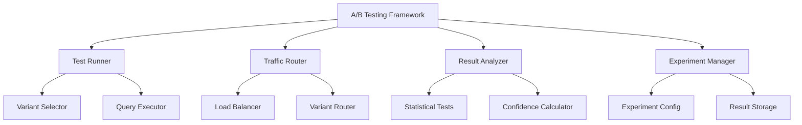

# A/B Testing Framework Specification

**Document ID:** AB-TESTING-FRAMEWORK-001
**Version:** 1.0.0
**Date:** 2025-08-30
**Authors:** SPARC Specification Writer

## 1. Overview

This specification defines a comprehensive A/B testing framework for evaluating and comparing different variants of the Personal RAG Chatbot system. The framework supports automated testing between baseline and experimental features (particularly MoE enhancements), statistical significance analysis, and continuous evaluation of system improvements.

## 2. System Architecture

### 2.1 Core Components



### 2.2 Integration Points

- **RAG Pipeline**: Variant selection and execution
- **Evaluation Harness**: Automated metric collection
- **Configuration System**: Feature flag management
- **Monitoring System**: Performance and health tracking
- **Data Storage**: Result persistence and analysis

## 3. Functional Requirements

### 3.1 Experiment Management

**FR-AB-001**: The A/B testing framework SHALL support creation and management of multiple concurrent experiments.

**FR-AB-002**: The A/B testing framework SHALL provide configurable traffic allocation between variants.

**FR-AB-003**: The A/B testing framework SHALL support feature flag-based variant selection.

**FR-AB-004**: The A/B testing framework SHALL maintain experiment isolation and result integrity.

**FR-AB-005**: The A/B testing framework SHALL provide experiment lifecycle management (create, start, pause, stop, analyze).

### 3.2 Statistical Analysis

**FR-AB-006**: The A/B testing framework SHALL perform statistical significance testing on experiment results.

**FR-AB-007**: The A/B testing framework SHALL calculate confidence intervals for all metrics.

**FR-AB-008**: The A/B testing framework SHALL support multiple statistical tests (t-test, z-test, chi-square).

**FR-AB-009**: The A/B testing framework SHALL provide power analysis for experiment planning.

**FR-AB-010**: The A/B testing framework SHALL detect and handle statistical anomalies.

### 3.3 Traffic Management

**FR-AB-011**: The A/B testing framework SHALL support uniform random traffic allocation.

**FR-AB-012**: The A/B testing framework SHALL support weighted traffic distribution.

**FR-AB-013**: The A/B testing framework SHALL provide sticky user sessions for consistent variant assignment.

**FR-AB-014**: The A/B testing framework SHALL support gradual traffic ramp-up and ramp-down.

**FR-AB-015**: The A/B testing framework SHALL handle traffic overflow and underflow conditions.

### 3.4 Result Analysis

**FR-AB-016**: The A/B testing framework SHALL collect comprehensive metrics for each variant.

**FR-AB-017**: The A/B testing framework SHALL provide real-time experiment monitoring.

**FR-AB-018**: The A/B testing framework SHALL generate detailed experiment reports.

**FR-AB-019**: The A/B testing framework SHALL support automated winner determination.

**FR-AB-020**: The A/B testing framework SHALL provide experiment result export capabilities.

## 4. Technical Specifications

### 4.1 Data Structures

#### Experiment Configuration
```python
@dataclass
class ExperimentConfig:
    """Configuration for an A/B testing experiment"""
    experiment_id: str
    name: str
    description: str

    # Variants
    variants: List[VariantConfig]

    # Traffic allocation
    traffic_allocation: Dict[str, float]  # variant_id -> percentage

    # Statistical parameters
    statistical_test: str = "t_test"
    alpha: float = 0.05  # Significance level
    power: float = 0.80  # Statistical power

    # Duration and sample size
    min_sample_size: int = 1000
    max_duration_days: int = 30
    auto_stop_enabled: bool = True

    # Metrics to track
    primary_metric: str = "ndcg@5"
    secondary_metrics: List[str] = None

    # Feature flags
    feature_flags: Dict[str, Any] = None
```

#### Variant Configuration
```python
@dataclass
class VariantConfig:
    """Configuration for a single experiment variant"""
    variant_id: str
    name: str
    description: str

    # System configuration
    config_overrides: Dict[str, Any]

    # Feature toggles
    features_enabled: List[str]
    features_disabled: List[str]

    # Resource allocation
    resource_limits: Dict[str, float] = None
```

#### Experiment Results
```python
@dataclass
class ExperimentResults:
    """Results from an A/B testing experiment"""
    experiment_id: str
    timestamp: float

    # Sample information
    total_samples: int
    variant_samples: Dict[str, int]

    # Metric results
    primary_metric_results: Dict[str, MetricResult]
    secondary_metric_results: Dict[str, MetricResult]

    # Statistical analysis
    statistical_tests: Dict[str, StatisticalTestResult]

    # Experiment status
    status: str  # "running", "completed", "stopped"
    winner: Optional[str] = None
    confidence_level: float = 0.0
```

#### Metric Result
```python
@dataclass
class MetricResult:
    """Result for a single metric"""
    metric_name: str
    variant_results: Dict[str, List[float]]  # variant_id -> list of values

    # Summary statistics
    means: Dict[str, float]
    confidence_intervals: Dict[str, Tuple[float, float]]

    # Statistical comparison
    p_value: float
    effect_size: float
    significant: bool
```

### 4.2 Core Algorithms

#### Traffic Allocation

**Uniform Random Allocation**:
```python
def allocate_uniform_random(query_id: str,
                          variants: List[str],
                          weights: Dict[str, float] = None) -> str:
    """
    Allocate traffic using uniform random selection with optional weights.

    Args:
        query_id: Unique query identifier for consistency
        variants: List of variant IDs
        weights: Optional weight dictionary for variants

    Returns:
        Selected variant ID
    """
    if weights:
        # Weighted random selection
        total_weight = sum(weights.values())
        normalized_weights = {v: w/total_weight for v, w in weights.items()}

        r = random.random()
        cumulative = 0.0
        for variant, weight in normalized_weights.items():
            cumulative += weight
            if r <= cumulative:
                return variant
    else:
        # Uniform random selection
        return random.choice(variants)
```

**Sticky Session Allocation**:
```python
class StickyAllocator:
    """Allocator that maintains consistent variant assignment for users/sessions"""

    def __init__(self, variants: List[str], weights: Dict[str, float] = None):
        self.variants = variants
        self.weights = weights or {v: 1.0 for v in variants}
        self._assignments = {}  # session_id -> variant

    def allocate(self, session_id: str) -> str:
        """Get consistent variant assignment for session"""
        if session_id not in self._assignments:
            self._assignments[session_id] = self._allocate_new(session_id)

        return self._assignments[session_id]

    def _allocate_new(self, session_id: str) -> str:
        """Allocate new variant for session"""
        # Use session_id as seed for deterministic assignment
        random.seed(hash(session_id))
        return allocate_uniform_random(session_id, self.variants, self.weights)
```

#### Statistical Significance Testing

**T-Test Implementation**:
```python
def perform_t_test(variant_a_values: List[float],
                  variant_b_values: List[float],
                  alpha: float = 0.05) -> Dict[str, Any]:
    """
    Perform two-sample t-test for statistical significance.

    Args:
        variant_a_values: Metric values for variant A
        variant_b_values: Metric values for variant B
        alpha: Significance level

    Returns:
        Dictionary with test results
    """
    # Calculate basic statistics
    mean_a = sum(variant_a_values) / len(variant_a_values)
    mean_b = sum(variant_b_values) / len(variant_b_values)

    # Perform t-test
    t_stat, p_value = stats.ttest_ind(variant_a_values, variant_b_values)

    # Calculate effect size (Cohen's d)
    pooled_std = math.sqrt(
        ((len(variant_a_values) - 1) * np.var(variant_a_values) +
         (len(variant_b_values) - 1) * np.var(variant_b_values)) /
        (len(variant_a_values) + len(variant_b_values) - 2)
    )

    effect_size = abs(mean_a - mean_b) / pooled_std if pooled_std > 0 else 0

    return {
        't_statistic': t_stat,
        'p_value': p_value,
        'significant': p_value < alpha,
        'effect_size': effect_size,
        'mean_a': mean_a,
        'mean_b': mean_b,
        'confidence_interval_a': _calculate_confidence_interval(variant_a_values),
        'confidence_interval_b': _calculate_confidence_interval(variant_b_values)
    }
```

**Power Analysis**:
```python
def calculate_required_sample_size(effect_size: float,
                                 alpha: float = 0.05,
                                 power: float = 0.80) -> int:
    """
    Calculate required sample size for statistical power.

    Args:
        effect_size: Expected effect size (Cohen's d)
        alpha: Significance level
        power: Desired statistical power

    Returns:
        Required sample size per variant
    """
    # Use t-distribution for sample size calculation
    t_alpha = stats.t.ppf(1 - alpha/2, df=1000)  # Approximate for large df
    t_power = stats.t.ppf(power, df=1000)

    # Sample size formula for two-sample t-test
    sample_size = ((t_alpha + t_power) / effect_size) ** 2

    return math.ceil(sample_size)
```

## 5. Implementation Architecture

### 5.1 Core Modules

#### Experiment Manager (`src/eval/ab_testing/experiment_manager.py`)
```python
class ExperimentManager:
    """Manages the lifecycle of A/B testing experiments"""

    def __init__(self, config_store, result_store):
        self.config_store = config_store
        self.result_store = result_store
        self.active_experiments = {}

    def create_experiment(self, config: ExperimentConfig) -> str:
        """Create a new A/B testing experiment"""
        experiment_id = str(uuid.uuid4())

        # Validate configuration
        self._validate_experiment_config(config)

        # Store configuration
        self.config_store.save_experiment_config(experiment_id, config)

        # Initialize experiment state
        self.active_experiments[experiment_id] = ExperimentState(
            experiment_id=experiment_id,
            status="created",
            start_time=None,
            sample_counts={v.variant_id: 0 for v in config.variants}
        )

        return experiment_id

    def start_experiment(self, experiment_id: str):
        """Start an A/B testing experiment"""
        if experiment_id not in self.active_experiments:
            raise ValueError(f"Experiment {experiment_id} not found")

        experiment = self.active_experiments[experiment_id]
        experiment.status = "running"
        experiment.start_time = time.time()

        # Initialize traffic allocator
        config = self.config_store.get_experiment_config(experiment_id)
        experiment.allocator = StickyAllocator(
            variants=[v.variant_id for v in config.variants],
            weights=config.traffic_allocation
        )

    def stop_experiment(self, experiment_id: str):
        """Stop an A/B testing experiment"""
        if experiment_id not in self.active_experiments:
            raise ValueError(f"Experiment {experiment_id} not found")

        experiment = self.active_experiments[experiment_id]
        experiment.status = "stopped"
        experiment.end_time = time.time()

        # Generate final results
        results = self._analyze_experiment_results(experiment_id)
        self.result_store.save_experiment_results(experiment_id, results)
```

#### Traffic Router (`src/eval/ab_testing/traffic_router.py`)
```python
class TrafficRouter:
    """Routes traffic between experiment variants"""

    def __init__(self, experiment_manager):
        self.experiment_manager = experiment_manager
        self._session_cache = {}  # session_id -> (experiment_id, variant_id)

    def route_query(self, query: Dict[str, Any],
                   session_id: str = None) -> Tuple[str, Dict[str, Any]]:
        """
        Route query to appropriate experiment variant.

        Args:
            query: Query object
            session_id: Optional session identifier for sticky routing

        Returns:
            Tuple of (variant_id, config_overrides)
        """
        # Determine applicable experiments
        applicable_experiments = self._find_applicable_experiments(query)

        if not applicable_experiments:
            # No experiments apply, use baseline
            return "baseline", {}

        # Select experiment (prioritize by recency or priority)
        experiment_id = self._select_experiment(applicable_experiments)

        # Get experiment state
        experiment = self.experiment_manager.active_experiments.get(experiment_id)
        if not experiment or experiment.status != "running":
            return "baseline", {}

        # Allocate variant
        if session_id:
            variant_id = experiment.allocator.allocate(session_id)
        else:
            # Random allocation for anonymous queries
            variant_id = experiment.allocator.allocate(str(uuid.uuid4()))

        # Get variant configuration
        config = self.experiment_manager.config_store.get_experiment_config(experiment_id)
        variant_config = next(v for v in config.variants if v.variant_id == variant_id)

        # Cache assignment for consistency
        if session_id:
            self._session_cache[session_id] = (experiment_id, variant_id)

        return variant_id, variant_config.config_overrides
```

#### Result Analyzer (`src/eval/ab_testing/result_analyzer.py`)
```python
class ResultAnalyzer:
    """Analyzes A/B testing experiment results"""

    def __init__(self, statistical_tester):
        self.statistical_tester = statistical_tester

    def analyze_experiment(self, experiment_id: str,
                          results_data: Dict[str, Any]) -> ExperimentResults:
        """
        Analyze results from an A/B testing experiment.

        Args:
            experiment_id: Unique experiment identifier
            results_data: Raw experiment results

        Returns:
            Analyzed experiment results
        """
        config = self._load_experiment_config(experiment_id)

        # Analyze primary metric
        primary_results = self._analyze_metric(
            config.primary_metric,
            results_data['variant_results'],
            config.alpha
        )

        # Analyze secondary metrics
        secondary_results = {}
        for metric in config.secondary_metrics or []:
            secondary_results[metric] = self._analyze_metric(
                metric,
                results_data['variant_results'],
                config.alpha
            )

        # Determine winner if statistically significant
        winner = self._determine_winner(primary_results, config.alpha)

        return ExperimentResults(
            experiment_id=experiment_id,
            timestamp=time.time(),
            total_samples=sum(results_data['sample_counts'].values()),
            variant_samples=results_data['sample_counts'],
            primary_metric_results=primary_results,
            secondary_metric_results=secondary_results,
            statistical_tests={},  # Populated by statistical_tester
            status="completed",
            winner=winner,
            confidence_level=self._calculate_overall_confidence(primary_results)
        )

    def _analyze_metric(self, metric_name: str,
                       variant_results: Dict[str, List[float]],
                       alpha: float) -> MetricResult:
        """Analyze a single metric across variants"""

        # Perform pairwise statistical tests
        variants = list(variant_results.keys())
        statistical_results = {}

        for i in range(len(variants)):
            for j in range(i+1, len(variants)):
                variant_a, variant_b = variants[i], variants[j]
                test_result = self.statistical_tester.perform_test(
                    variant_results[variant_a],
                    variant_results[variant_b],
                    alpha=alpha
                )
                statistical_results[f"{variant_a}_vs_{variant_b}"] = test_result

        return MetricResult(
            metric_name=metric_name,
            variant_results=variant_results,
            means={v: sum(vals)/len(vals) for v, vals in variant_results.items()},
            confidence_intervals={
                v: self._calculate_confidence_interval(vals)
                for v, vals in variant_results.items()
            },
            p_value=min(r['p_value'] for r in statistical_results.values()),
            effect_size=max(r['effect_size'] for r in statistical_results.values()),
            significant=any(r['significant'] for r in statistical_results.values())
        )
```

## 6. Configuration Schema

### 6.1 Experiment Configuration

```yaml
ab_testing:
  enabled: true
  max_concurrent_experiments: 3

  # Default statistical parameters
  default_alpha: 0.05
  default_power: 0.80
  default_min_sample_size: 1000

  # Traffic management
  sticky_sessions: true
  session_timeout_hours: 24

  # Monitoring and alerting
  monitoring:
    enabled: true
    alert_on_early_winner: true
    alert_on_sample_size_reached: true

  # Data retention
  result_retention_days: 90
  raw_data_retention_days: 30

experiments:
  - experiment_id: "moe_baseline_comparison"
    name: "MoE vs Baseline Retrieval"
    description: "Compare MoE-enhanced retrieval with baseline system"

    variants:
      - variant_id: "baseline"
        name: "Baseline System"
        config_overrides:
          moe:
            enabled: false

      - variant_id: "moe_full"
        name: "Full MoE System"
        config_overrides:
          moe:
            enabled: true
            router:
              enabled: true
            gate:
              enabled: true
            reranker:
              stage1_enabled: true
              stage2_enabled: false

    traffic_allocation:
      baseline: 0.5
      moe_full: 0.5

    primary_metric: "ndcg@5"
    secondary_metrics:
      - "hit@3"
      - "mrr"
      - "answer_quality"

    statistical_test: "t_test"
    alpha: 0.05
    power: 0.80
    min_sample_size: 2000
    max_duration_days: 14
```

## 7. Quality Assurance

### 7.1 Test Coverage Requirements

- **Unit Tests**: All allocation algorithms, statistical tests, and core logic
- **Integration Tests**: End-to-end experiment execution and analysis
- **Statistical Tests**: Validation of statistical analysis correctness
- **Performance Tests**: Scalability and resource usage validation

### 7.2 Validation Procedures

#### Statistical Validation
```python
def validate_statistical_tests():
    """Validate statistical testing implementations"""

    # Test with known distributions
    np.random.seed(42)

    # Generate synthetic data with known effect size
    group_a = np.random.normal(0.75, 0.1, 1000)
    group_b = np.random.normal(0.78, 0.1, 1000)  # Small effect

    # Perform t-test
    result = perform_t_test(group_a, group_b)

    # Validate results
    assert result['significant'] == True  # Should detect difference
    assert 0.02 < result['effect_size'] < 0.04  # Expected effect size range
    assert result['p_value'] < 0.05  # Should be significant
```

#### Traffic Allocation Validation
```python
def validate_traffic_allocation():
    """Validate traffic allocation algorithms"""

    variants = ["A", "B", "C"]
    weights = {"A": 0.5, "B": 0.3, "C": 0.2}

    # Test uniform allocation
    allocator = StickyAllocator(variants)
    assignments = [allocator.allocate(f"session_{i}") for i in range(10000)]

    # Check approximate uniform distribution
    counts = Counter(assignments)
    for variant in variants:
        proportion = counts[variant] / len(assignments)
        assert 0.3 < proportion < 0.37  # Allow some variance

    # Test weighted allocation
    weighted_allocator = StickyAllocator(variants, weights)
    assignments = [weighted_allocator.allocate(f"session_{i}") for i in range(10000)]

    counts = Counter(assignments)
    assert counts["A"] / len(assignments) > counts["B"] / len(assignments)
    assert counts["B"] / len(assignments) > counts["C"] / len(assignments)
```

## 8. Performance Characteristics

### 8.1 Latency Budget

| Operation | Target Latency | Acceptable Range |
|-----------|----------------|------------------|
| Traffic Allocation | <1ms | <5ms |
| Variant Selection | <2ms | <10ms |
| Result Recording | <5ms | <20ms |
| Statistical Analysis | <100ms | <500ms |

### 8.2 Resource Requirements

| Resource | Baseline Usage | Peak Usage |
|----------|----------------|------------|
| Memory | <100MB | <500MB |
| CPU | <10% | <30% |
| Storage | <1GB/day | <5GB/day |

### 8.3 Scalability Targets

- **Concurrent Experiments**: Support 5+ simultaneous experiments
- **Query Throughput**: Handle 1000+ queries/second
- **Result Storage**: Maintain 6+ months of experiment history
- **Analysis Performance**: Generate reports in <60 seconds

## 9. Monitoring and Alerting

### 9.1 Health Checks

- **Traffic Distribution**: Verify allocation matches expected weights
- **Experiment Progress**: Monitor sample size accumulation
- **Statistical Power**: Ensure adequate sample sizes for significance
- **System Performance**: Track latency and resource usage

### 9.2 Alert Conditions

- **Traffic Imbalance**: Allocation deviates >10% from expected
- **Sample Size Issues**: Experiments running without adequate samples
- **Statistical Anomalies**: Unexpected p-values or effect sizes
- **Performance Degradation**: Latency increases >50%

### 9.3 Automated Actions

- **Traffic Rebalancing**: Automatically adjust weights for imbalance
- **Experiment Stopping**: Auto-stop experiments reaching significance early
- **Resource Scaling**: Scale resources based on experiment load
- **Result Archival**: Automatically archive completed experiments

## 10. Security Considerations

### 10.1 Data Protection

- **Experiment Data**: Encrypt sensitive experiment results
- **User Assignment**: Anonymize user identifiers in experiment logs
- **Statistical Results**: Secure access to detailed statistical analysis
- **Configuration**: Restrict access to experiment configuration

### 10.2 Access Control

- **Experiment Management**: Role-based access to create/modify experiments
- **Result Viewing**: Restricted access to experiment results and analysis
- **Configuration**: Administrative access for A/B testing settings
- **Audit Logging**: Complete audit trail of experiment activities

## 11. Integration with MoE System

### 11.1 MoE-Specific Experiments

```python
def create_moe_comparison_experiment() -> ExperimentConfig:
    """Create experiment comparing different MoE configurations"""

    return ExperimentConfig(
        experiment_id="moe_ablation_study",
        name="MoE Component Ablation Study",
        description="Test impact of individual MoE components",

        variants=[
            VariantConfig(
                variant_id="baseline",
                name="No MoE",
                config_overrides={"moe": {"enabled": False}}
            ),
            VariantConfig(
                variant_id="router_only",
                name="Router Only",
                config_overrides={
                    "moe": {
                        "enabled": True,
                        "router": {"enabled": True},
                        "gate": {"enabled": False},
                        "reranker": {"stage1_enabled": False}
                    }
                }
            ),
            VariantConfig(
                variant_id="router_gate",
                name="Router + Gate",
                config_overrides={
                    "moe": {
                        "enabled": True,
                        "router": {"enabled": True},
                        "gate": {"enabled": True},
                        "reranker": {"stage1_enabled": False}
                    }
                }
            ),
            VariantConfig(
                variant_id="full_moe",
                name="Full MoE",
                config_overrides={
                    "moe": {
                        "enabled": True,
                        "router": {"enabled": True},
                        "gate": {"enabled": True},
                        "reranker": {"stage1_enabled": True}
                    }
                }
            )
        ],

        traffic_allocation={
            "baseline": 0.4,
            "router_only": 0.2,
            "router_gate": 0.2,
            "full_moe": 0.2
        },

        primary_metric="ndcg@5",
        min_sample_size=5000
    )
```

### 11.2 MoE Performance Tracking

```python
class MoEExperimentTracker:
    """Specialized tracker for MoE-specific metrics"""

    def __init__(self):
        self.moe_metrics = [
            "routing_accuracy",
            "gate_efficiency",
            "reranking_improvement",
            "expert_utilization"
        ]

    def track_moe_performance(self, experiment_id: str,
                            variant_id: str, query_result: Dict[str, Any]):
        """Track MoE-specific performance metrics"""

        metrics = {}

        # Routing metrics
        if "routing_decision" in query_result:
            routing_correct = query_result["routing_decision"]["correct"]
            metrics["routing_accuracy"] = 1.0 if routing_correct else 0.0

        # Gate metrics
        if "gate_decision" in query_result:
            gate_efficient = query_result["gate_decision"]["efficient"]
            metrics["gate_efficiency"] = 1.0 if gate_efficient else 0.0

        # Reranking metrics
        if "reranking_result" in query_result:
            improvement = query_result["reranking_result"]["improvement"]
            metrics["reranking_improvement"] = improvement

        return metrics
```

## 12. Future Enhancements

### 12.1 Advanced Features

- **Multi-Armed Bandit**: Dynamic traffic allocation optimization
- **Bayesian Testing**: Probabilistic significance testing
- **Sequential Testing**: Continuous monitoring with early stopping
- **Contextual Bandits**: User/context-aware variant selection

### 12.2 Machine Learning Integration

- **Automated Experimentation**: ML-driven experiment design and analysis
- **Predictive Modeling**: Forecast experiment outcomes and duration
- **Personalization**: User-specific variant assignment
- **Adaptive Experiments**: Dynamic experiment modification based on results

### 12.3 Advanced Analytics

- **Causal Inference**: Understand causal relationships in experiment results
- **Longitudinal Analysis**: Track user behavior across multiple experiments
- **Network Effects**: Analyze interaction effects between variants
- **External Validity**: Assess generalizability of experiment results

---

This specification provides a comprehensive framework for A/B testing that enables data-driven evaluation and continuous improvement of the Personal RAG Chatbot system, with particular emphasis on validating MoE enhancements.