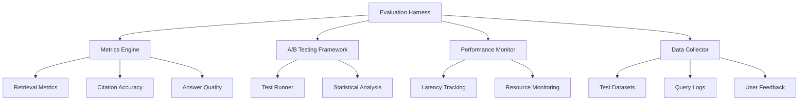

# Evaluation Harness Specification

**Document ID:** EVAL-HARNESS-001
**Version:** 1.0.0
**Date:** 2025-08-30
**Authors:** SPARC Specification Writer

## 1. Overview

This specification defines a comprehensive evaluation harness for the Personal RAG Chatbot system. The evaluation harness provides quantitative metrics and qualitative assessments to validate retrieval quality, answer accuracy, citation precision, and system performance. It supports both offline evaluation and real-time monitoring, with specific provisions for A/B testing between baseline and MoE-enhanced retrieval systems.

## 2. System Architecture

### 2.1 Core Components



### 2.2 Integration Points

- **RAG Pipeline**: Hooks into query processing, retrieval, and answer generation
- **MoE System**: Specialized metrics for expert routing, gating, and reranking
- **Vector Store**: Retrieval result capture and analysis
- **LLM API**: Cost tracking and answer quality evaluation
- **UI Layer**: Real-time metrics display and user feedback collection

## 3. Functional Requirements

### 3.1 Retrieval Quality Evaluation

**FR-EVAL-001**: The evaluation harness SHALL compute retrieval quality metrics including Hit@k, NDCG@k, and MRR.

**FR-EVAL-002**: The evaluation harness SHALL support configurable k values for all retrieval metrics.

**FR-EVAL-003**: The evaluation harness SHALL handle both single and multi-relevant document scenarios.

**FR-EVAL-004**: The evaluation harness SHALL provide statistical significance testing for retrieval improvements.

### 3.2 Citation Accuracy Evaluation

**FR-EVAL-005**: The evaluation harness SHALL evaluate citation span accuracy using character-level precision and recall.

**FR-EVAL-006**: The evaluation harness SHALL validate citation format compliance with system standards.

**FR-EVAL-007**: The evaluation harness SHALL detect citation hallucinations and missing citations.

**FR-EVAL-008**: The evaluation harness SHALL measure citation completeness across answer spans.

### 3.3 Answer Quality Assessment

**FR-EVAL-009**: The evaluation harness SHALL perform LLM-based answer relevance evaluation.

**FR-EVAL-010**: The evaluation harness SHALL assess answer completeness and factual accuracy.

**FR-EVAL-011**: The evaluation harness SHALL measure answer conciseness and clarity.

**FR-EVAL-012**: The evaluation harness SHALL support human-in-the-loop quality assessment workflows.

### 3.4 A/B Testing Framework

**FR-EVAL-013**: The evaluation harness SHALL support automated A/B testing between system variants.

**FR-EVAL-014**: The evaluation harness SHALL provide statistical significance analysis for A/B test results.

**FR-EVAL-015**: The evaluation harness SHALL enable feature flag-based variant selection.

**FR-EVAL-016**: The evaluation harness SHALL maintain test isolation and result integrity.

### 3.5 Performance Benchmarking

**FR-EVAL-017**: The evaluation harness SHALL measure end-to-end query latency with component breakdown.

**FR-EVAL-018**: The evaluation harness SHALL monitor system resource usage (CPU, memory, network).

**FR-EVAL-019**: The evaluation harness SHALL track API costs and usage patterns.

**FR-EVAL-020**: The evaluation harness SHALL provide performance regression detection.

### 3.6 Data Collection and Management

**FR-EVAL-021**: The evaluation harness SHALL collect comprehensive query execution traces.

**FR-EVAL-022**: The evaluation harness SHALL maintain evaluation datasets with ground truth annotations.

**FR-EVAL-023**: The evaluation harness SHALL support incremental evaluation result accumulation.

**FR-EVAL-024**: The evaluation harness SHALL provide data export capabilities for external analysis.

## 4. Technical Specifications

### 4.1 Data Structures

#### Query Evaluation Record
```python
@dataclass
class QueryEvaluationRecord:
    """Complete evaluation record for a single query"""
    query_id: str
    timestamp: float
    query_text: str

    # Retrieval results
    retrieved_docs: List[Dict[str, Any]]
    relevant_docs: List[str]  # Ground truth document IDs

    # Answer and citations
    generated_answer: str
    citations: List[Dict[str, Any]]  # Citation spans with metadata

    # Performance metrics
    latency_breakdown: Dict[str, float]
    resource_usage: Dict[str, float]

    # Quality scores
    retrieval_metrics: Dict[str, float]
    citation_accuracy: Dict[str, float]
    answer_quality: Dict[str, float]
```

#### Test Dataset Format
```python
@dataclass
class EvaluationDataset:
    """Structured evaluation dataset"""
    name: str
    version: str
    description: str

    queries: List[Dict[str, Any]]  # Query with ground truth
    documents: List[Dict[str, Any]]  # Document collection
    annotations: Dict[str, Any]  # Additional metadata
```

### 4.2 Configuration Schema

```yaml
evaluation:
  enabled: true
  mode: "offline"  # offline, online, hybrid

  metrics:
    retrieval:
      hit_at_k: [1, 3, 5, 10]
      ndcg_at_k: [1, 3, 5, 10]
      mrr: true
      map: true
    citation:
      span_accuracy: true
      format_compliance: true
      hallucination_detection: true
    answer:
      relevance_scoring: true
      completeness_check: true
      factual_accuracy: true

  ab_testing:
    enabled: true
    variants:
      - name: "baseline"
        features: ["standard_retrieval"]
      - name: "moe_full"
        features: ["expert_routing", "selective_gating", "reranking"]
    sample_size: 1000
    confidence_level: 0.95

  performance:
    latency_thresholds:
      embedding: 5.0  # seconds
      retrieval: 0.2  # seconds
      llm_call: 10.0  # seconds
    resource_limits:
      memory_mb: 4096
      cpu_percent: 80

  data_collection:
    sample_rate: 0.1  # 10% of queries
    retention_days: 30
    export_formats: ["json", "csv", "parquet"]
```

## 5. Implementation Architecture

### 5.1 Core Modules

#### Metrics Engine (`src/eval/metrics.py`)
- **RetrievalMetrics**: Hit@k, NDCG@k, MRR, MAP calculations
- **CitationMetrics**: Span accuracy, format validation, hallucination detection
- **AnswerMetrics**: Relevance scoring, completeness assessment
- **StatisticalAnalysis**: Significance testing, confidence intervals

#### A/B Testing Framework (`src/eval/ab_testing.py`)
- **TestRunner**: Automated test execution with variant selection
- **ResultAnalyzer**: Statistical analysis of test results
- **ExperimentManager**: Test lifecycle management and reporting

#### Performance Monitor (`src/eval/performance.py`)
- **LatencyTracker**: Component-level timing measurements
- **ResourceMonitor**: System resource usage tracking
- **RegressionDetector**: Performance anomaly detection

#### Data Collector (`src/eval/collector.py`)
- **QueryLogger**: Comprehensive query execution logging
- **DatasetManager**: Evaluation dataset management
- **ExportManager**: Result export and visualization

### 5.2 Integration Patterns

#### RAG Pipeline Integration
```python
class EnhancedRAGPipeline:
    def __init__(self, config, evaluator=None):
        self.evaluator = evaluator

    async def query(self, query_text: str) -> Dict[str, Any]:
        start_time = time.time()

        # Execute query with full tracing
        result = await self._execute_query(query_text)

        # Collect evaluation data if enabled
        if self.evaluator:
            evaluation_record = self._create_evaluation_record(
                query_text, result, start_time
            )
            await self.evaluator.record_evaluation(evaluation_record)

        return result
```

#### MoE System Integration
```python
class MoEEvaluator:
    def __init__(self, config):
        self.config = config
        self.metrics = MoEMetrics()

    def evaluate_routing(self, query_embedding, chosen_experts, similarities):
        """Evaluate expert routing quality"""
        return self.metrics.calculate_routing_accuracy(
            query_embedding, chosen_experts, similarities
        )

    def evaluate_gate(self, decision, confidence, actual_relevance):
        """Evaluate selective gate performance"""
        return self.metrics.calculate_gate_efficiency(
            decision, confidence, actual_relevance
        )
```

## 6. Quality Assurance

### 6.1 Test Coverage Requirements

- **Unit Tests**: All metric calculations with known test cases
- **Integration Tests**: End-to-end evaluation pipeline validation
- **Performance Tests**: Scalability and resource usage validation
- **Statistical Tests**: A/B testing framework validation

### 6.2 Validation Procedures

#### Metric Validation
```python
def validate_metrics():
    """Validate metric implementations against known test cases"""

    # Test Hit@k calculation
    test_case = {
        "relevant_ids": "doc1;doc2;doc3",
        "predicted_ids": "doc2;doc4;doc1;doc5",
        "expected_hit_at_3": 1.0,  # doc2 and doc1 are hits
        "expected_hit_at_1": 0.0   # doc2 is not first
    }

    assert hit_at_k(test_case["relevant_ids"], test_case["predicted_ids"], k=3) == test_case["expected_hit_at_3"]
    assert hit_at_k(test_case["relevant_ids"], test_case["predicted_ids"], k=1) == test_case["expected_hit_at_1"]
```

#### Statistical Validation
```python
def validate_ab_testing():
    """Validate A/B testing statistical analysis"""

    # Generate synthetic test results
    baseline_results = np.random.normal(0.75, 0.05, 1000)
    variant_results = np.random.normal(0.78, 0.05, 1000)

    # Test significance calculation
    t_stat, p_value = calculate_significance(baseline_results, variant_results)

    assert p_value < 0.05  # Should detect significant difference
    assert t_stat > 0  # Variant should be better
```

## 7. Performance Characteristics

### 7.1 Latency Budget

| Component | Target Latency | Acceptable Range |
|-----------|----------------|------------------|
| Metric Calculation | <1ms | <5ms |
| Data Collection | <10ms | <50ms |
| Statistical Analysis | <100ms | <500ms |
| Result Export | <1s | <5s |

### 7.2 Resource Requirements

| Resource | Baseline Usage | Peak Usage |
|----------|----------------|------------|
| Memory | <50MB | <200MB |
| CPU | <5% | <20% |
| Storage | <100MB/day | <500MB/day |

### 7.3 Scalability Targets

- **Concurrent Evaluations**: Support 100+ simultaneous evaluation runs
- **Dataset Size**: Handle evaluation datasets with 10K+ queries
- **Result Storage**: Maintain 30+ days of evaluation history
- **Export Performance**: Generate reports in <30 seconds

## 8. Deployment and Operations

### 8.1 Configuration Management

The evaluation harness configuration SHALL be managed through the main application configuration system with evaluation-specific overrides:

```yaml
# Main config.yaml
evaluation:
  enabled: true
  datasets:
    - name: "dev_set"
      path: "data/evaluation/dev.json"
    - name: "test_set"
      path: "data/evaluation/test.json"
```

### 8.2 Monitoring and Alerting

#### Health Checks
- **Data Collection**: Verify evaluation data is being captured
- **Metric Calculation**: Ensure metrics are computed without errors
- **Statistical Analysis**: Validate statistical test results
- **Performance**: Monitor evaluation system performance

#### Alert Conditions
- Metric calculation failures > 1%
- Statistical analysis errors > 0.1%
- Performance degradation > 20%
- Data collection gaps > 5 minutes

### 8.3 Maintenance Procedures

#### Regular Maintenance
- **Dataset Updates**: Refresh evaluation datasets quarterly
- **Metric Calibration**: Recalibrate metrics against human judgments
- **Performance Tuning**: Optimize based on usage patterns
- **Result Archival**: Archive old evaluation results

#### Emergency Procedures
- **System Failure**: Fallback to minimal evaluation mode
- **Data Loss**: Restore from backups and resume collection
- **Performance Issues**: Scale down evaluation scope temporarily

## 9. Security Considerations

### 9.1 Data Protection

- **Evaluation Data**: Treat as sensitive, encrypt at rest
- **Query Logs**: Anonymize personally identifiable information
- **Result Storage**: Secure access controls for evaluation results
- **Export Security**: Validate export destinations and formats

### 9.2 Access Control

- **Evaluation Access**: Role-based access to evaluation features
- **Result Viewing**: Restricted access to detailed evaluation results
- **Configuration**: Administrative access for evaluation settings
- **Audit Logging**: Complete audit trail of evaluation activities

## 10. Future Enhancements

### 10.1 Advanced Features

- **Online Learning**: Continuous model improvement from evaluation feedback
- **Multi-Modal Evaluation**: Support for image and video content evaluation
- **Federated Evaluation**: Distributed evaluation across multiple instances
- **Real-Time Adaptation**: Dynamic parameter tuning based on evaluation results

### 10.2 Integration Extensions

- **External Benchmarks**: Integration with standard IR evaluation datasets
- **Third-Party Tools**: Support for external evaluation platforms
- **API Integration**: RESTful API for external evaluation systems
- **Visualization**: Advanced dashboards and reporting capabilities

---

This specification provides the foundation for a comprehensive evaluation harness that ensures the Personal RAG Chatbot maintains high quality and performance standards while supporting continuous improvement through data-driven insights.