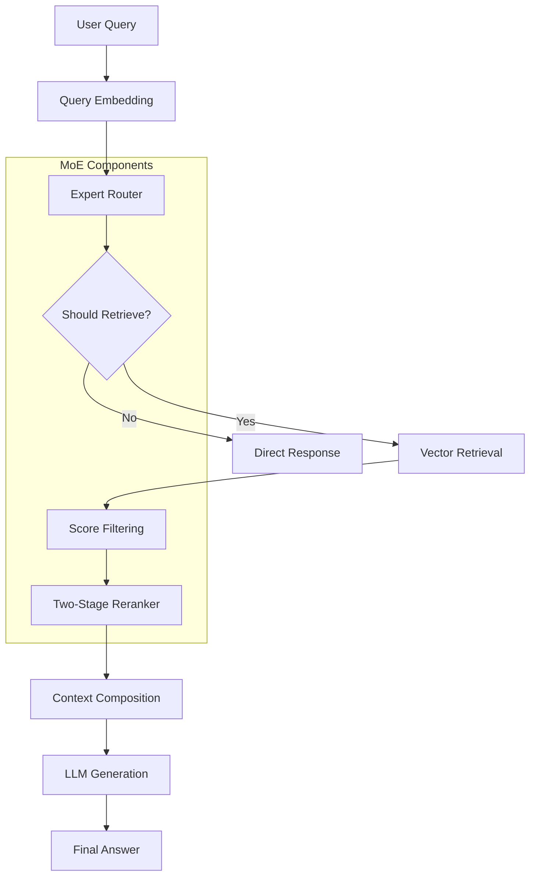

# Mixture of Experts (MoE) Architecture Specification

## Document Information
- **Document ID:** MOE-ARCH-SPEC-001
- **Version:** 1.0.0
- **Created:** 2025-08-30
- **Last Updated:** 2025-08-30
- **Status:** Draft

## Executive Summary

This specification defines the architecture for a Mixture of Experts (MoE) system integrated into the Personal RAG Chatbot. The MoE implementation provides intelligent query routing, selective retrieval gating, and two-stage reranking to enhance retrieval quality and answer accuracy while maintaining performance efficiency.

## 1. Architecture Overview

### 1.1 System Context

The MoE system operates as an enhancement layer within the existing RAG pipeline, providing:

- **Expert Routing**: Intelligent distribution of queries to specialized retrieval experts
- **Selective Retrieval**: Adaptive retrieval based on query complexity and confidence levels
- **Two-Stage Reranking**: Cross-encoder and optional LLM-based result refinement
- **Performance Optimization**: Dynamic parameter adjustment based on query characteristics

### 1.2 Core Components



### 1.3 Component Relationships

| Component | Input | Output | Dependencies |
|-----------|-------|--------|-------------|
| Expert Router | Query embedding | Expert selection + routing confidence | Expert centroids |
| Selective Gate | Router similarities + query complexity | Retrieval decision + optimal k | Router output |
| Score Filter | Raw matches + query embedding | Filtered matches | Gate parameters |
| Two-Stage Reranker | Filtered matches + query | Reranked matches + uncertainty | Cross-encoder model |

## 2. Expert Router Architecture

### 2.1 Purpose
Routes queries to the most relevant retrieval experts based on semantic similarity to expert centroids.

### 2.2 Key Features
- **Centroid Management**: Maintains expert centroids updated from recent document embeddings
- **Similarity Calculation**: Cosine similarity scoring against expert centroids
- **Top-K Selection**: Routes to most relevant experts (configurable k)
- **Confidence Tracking**: Provides routing confidence scores for downstream decisions

### 2.3 Data Structures

```python
@dataclass
class ExpertCentroid:
    expert_id: str
    centroid: np.ndarray
    document_count: int
    last_updated: float
    confidence_score: float

@dataclass
class RoutingResult:
    chosen_experts: List[str]
    similarities: Dict[str, float]
    confidence: float
    timestamp: float
```

## 3. Selective Gate Architecture

### 3.1 Purpose
Determines whether retrieval is necessary and selects optimal retrieval parameters based on routing confidence.

### 3.2 Decision Logic

```python
def should_retrieve_and_k(
    router_similarities: Dict[str, float],
    query_complexity_score: float = 0.5
) -> Tuple[bool, int]:
    max_similarity = max(router_similarities.values())

    # Gate decision: retrieve if confidence is low enough
    should_retrieve = max_similarity < RETRIEVE_SIM_THRESHOLD

    if not should_retrieve:
        return False, K_MIN

    # Adaptive k selection
    if max_similarity < LOW_SIM_THRESHOLD:
        k = K_MAX  # Low confidence: cast wider net
    else:
        k = DEFAULT_TOP_K  # Medium confidence: use default

    return True, k
```

### 3.3 Threshold Configuration

| Threshold | Default Value | Purpose |
|-----------|---------------|---------|
| `retrieve_sim_threshold` | 0.62 | Minimum similarity for skipping retrieval |
| `low_sim_threshold` | 0.45 | Threshold for maximum retrieval breadth |
| `k_min` | 4 | Minimum retrieval count |
| `k_max` | 15 | Maximum retrieval count |
| `default_top_k` | 8 | Standard retrieval count |

## 4. Two-Stage Reranking Architecture

### 4.1 Stage 1: Cross-Encoder Reranking

**Purpose**: Provides high-quality relevance scoring using cross-encoder models.

**Process**:
1. Prepare query-passage pairs for all retrieved documents
2. Score pairs using cross-encoder model
3. Sort results by cross-encoder scores
4. Calculate uncertainty from score distribution

**Performance Characteristics**:
- Model: `cross-encoder/ms-marco-MiniLM-L-6-v2`
- Expected NDCG@10: ~74.30
- Throughput: ~1800 docs/sec
- Memory footprint: ~22MB

### 4.2 Stage 2: LLM-Based Reranking (Conditional)

**Purpose**: Applies advanced reasoning for uncertain results.

**Activation Conditions**:
- Cross-encoder uncertainty > threshold (default: 0.15)
- Sufficient candidates available (≥3)
- Feature enabled in configuration

**Process**:
1. Prepare LLM prompt with query and top passages
2. Request ranking from LLM
3. Parse and apply LLM ranking
4. Fallback to cross-encoder results on failure

## 5. Integration Architecture

### 5.1 Pipeline Integration Points

```python
class EnhancedRAGPipeline:
    def __init__(self, config):
        # Initialize MoE components if enabled
        if config.moe.enabled:
            self.router = ExpertRouter(config)
            self.gate = SelectiveGate(config)
            self.reranker = TwoStageReranker(config)

    def rag_chat(self, embedder, message: str, history):
        # 1. Generate query embedding
        query_embedding = embedder.encode([message], normalize_embeddings=True)[0]

        # 2. MoE Routing (if enabled)
        chosen_experts, router_similarities = self.router.route_query(query_embedding)

        # 3. Retrieval Gating (if enabled)
        should_retrieve, k = self.gate.should_retrieve_and_k(router_similarities)

        if not should_retrieve:
            return self._generate_no_context_response(message)

        # 4. Vector Store Query with expert filtering
        query_filter = {"expert_id": {"$in": chosen_experts}} if chosen_experts else None
        search_results = query(config, query_embedding.tolist(), top_k=k, filter=query_filter)

        # 5. Score-based Filtering
        matches = self.gate.apply_score_filtering(search_results["matches"], query_embedding)

        # 6. Reranking Pipeline
        matches = self.reranker.rerank(message, matches)

        # 7. Continue with context composition and LLM call...
```

### 5.2 Configuration Integration

```yaml
moe:
  enabled: false  # Master toggle

  # Router Configuration
  router:
    enabled: true
    experts: ["general", "technical", "personal", "code"]
    centroid_refresh_interval: 3600
    top_k_experts: 2

  # Gate Configuration
  gate:
    enabled: true
    retrieve_sim_threshold: 0.62
    low_sim_threshold: 0.45

  # Dynamic Retrieval
  retrieval:
    high_score_cutoff: 0.8
    low_score_cutoff: 0.5
    k_min: 4
    k_max: 15
    default_top_k: 8

  # Reranking Configuration
  reranker:
    stage1_enabled: true
    stage2_enabled: false
    cross_encoder_model: "cross-encoder/ms-marco-MiniLM-L-6-v2"
    uncertainty_threshold: 0.15
    max_candidates: 50
```

## 6. Performance Characteristics

### 6.1 Latency Breakdown

| Component | Expected Latency | Notes |
|-----------|------------------|-------|
| Expert Router | <10ms | In-memory centroid comparison |
| Selective Gate | <5ms | Simple threshold logic |
| Vector Retrieval | 100-500ms | Network + Pinecone query |
| Cross-Encoder Reranking | 50-200ms | Batch processing |
| LLM Reranking | 2-5s | Only when uncertainty high |

**Total MoE Overhead**: 150-700ms (vs 100-500ms baseline)

### 6.2 Memory Requirements

| Component | Memory Footprint | Notes |
|-----------|------------------|-------|
| Expert Centroids | <50MB | Stored in memory |
| Cross-Encoder Model | ~22MB | Cached after first load |
| Router State | <10MB | Metadata and indices |
| **Total MoE Memory** | <100MB | Additional to baseline |

### 6.3 Scalability Considerations

- **Expert Count**: Linear scaling with number of experts
- **Document Volume**: Centroid updates every 3600s (configurable)
- **Concurrent Queries**: Thread-safe implementation required
- **Model Caching**: Shared model instances across requests

## 7. Quality Metrics

### 7.1 Retrieval Quality Metrics

| Metric | Target | Measurement Method |
|--------|--------|-------------------|
| Hit@K | >0.85 | Proportion of relevant docs in top-K |
| NDCG@10 | >0.75 | Normalized discounted cumulative gain |
| Citation Accuracy | >0.90 | Correct span identification rate |
| Answer Relevance | >0.80 | LLM evaluation of answer quality |

### 7.2 MoE-Specific Metrics

| Metric | Target | Purpose |
|--------|--------|---------|
| Routing Accuracy | >0.75 | Correct expert selection rate |
| Gate Precision | >0.80 | Accuracy of retrieval decisions |
| Reranking Improvement | >0.10 | NDCG improvement over baseline |
| Uncertainty Calibration | <0.15 | Cross-entropy loss for confidence |

## 8. Error Handling & Resilience

### 8.1 Component Failure Modes

| Component | Failure Mode | Mitigation |
|-----------|--------------|------------|
| Expert Router | No centroids available | Use default expert routing |
| Selective Gate | Invalid similarities | Fall back to default retrieval |
| Cross-Encoder | Model loading failure | Skip reranking, use original scores |
| LLM Reranker | API failure/timeout | Fall back to cross-encoder results |

### 8.2 Graceful Degradation

```python
def safe_moe_pipeline(query_embedding, matches):
    """Execute MoE pipeline with graceful degradation"""

    try:
        # Attempt full MoE pipeline
        if self.router:
            experts, similarities = self.router.route_query(query_embedding)
        else:
            experts, similarities = None, {}

        if self.gate:
            should_retrieve, k = self.gate.should_retrieve_and_k(similarities)
        else:
            should_retrieve, k = True, self.config.TOP_K

        if self.reranker:
            reranked_matches = self.reranker.rerank(query, matches)
        else:
            reranked_matches = matches

        return reranked_matches

    except Exception as e:
        logger.warning(f"MoE pipeline failed: {e}, falling back to baseline")
        return matches  # Original matches unchanged
```

## 9. Security Considerations

### 9.1 Model Security
- All models loaded with `trust_remote_code=False`
- Input validation on all text inputs
- Rate limiting on expert routing decisions
- Secure storage of expert centroids (no sensitive data)

### 9.2 API Security
- LLM reranking respects existing OpenRouter security controls
- No additional external API calls beyond existing pipeline
- All network communications use existing secure channels

## 10. Testing & Validation

### 10.1 Unit Testing Requirements

```python
class TestExpertRouter:
    def test_centroid_similarity_calculation(self):
        # Test cosine similarity computation
        # Test expert selection logic
        # Test confidence score calculation

    def test_routing_with_empty_centroids(self):
        # Test fallback behavior
        # Test default expert selection

class TestSelectiveGate:
    def test_gate_decision_logic(self):
        # Test threshold-based decisions
        # Test adaptive k selection
        # Test edge cases (empty similarities)

class TestTwoStageReranker:
    def test_cross_encoder_scoring(self):
        # Test score computation
        # Test uncertainty calculation
        # Test result sorting

    def test_llm_reranking_fallback(self):
        # Test API failure handling
        # Test timeout scenarios
```

### 10.2 Integration Testing

- **End-to-End Pipeline**: Complete query processing with MoE enabled
- **Performance Regression**: Compare latency with/without MoE
- **Quality Validation**: A/B testing against baseline retrieval
- **Configuration Testing**: All feature flag combinations

## 11. Deployment & Operations

### 11.1 Feature Flags

```python
# Environment variables for feature control
MOE_ENABLED=false              # Master toggle
MOE_ROUTER_ENABLED=true        # Enable expert routing
MOE_GATE_ENABLED=true          # Enable selective retrieval
MOE_RERANKER_ENABLED=true      # Enable two-stage reranking
MOE_STAGE2_ENABLED=false       # Enable expensive LLM reranking
```

### 11.2 Monitoring & Observability

```python
@dataclass
class MoEMetrics:
    query_id: str
    timestamp: float

    # Timing metrics
    total_time: float
    routing_time: float
    gate_time: float
    reranking_time: float

    # Quality metrics
    routing_confidence: float
    gate_decision: bool
    reranking_improvement: float
    final_relevance_score: float

    # Resource metrics
    memory_usage_mb: float
    models_loaded: List[str]
```

### 11.3 Maintenance Procedures

- **Centroid Updates**: Automatic refresh every 3600s (configurable)
- **Model Updates**: Manual update process for cross-encoder models
- **Performance Tuning**: Threshold adjustment based on usage patterns
- **Log Analysis**: Regular review of MoE-specific metrics and errors

## 12. Future Extensions

### 12.1 Advanced Features
- **Dynamic Expert Creation**: Automatic expert discovery from document clustering
- **Multi-Modal Experts**: Support for image, audio, and video content
- **Federated Learning**: Collaborative expert training across deployments
- **Real-time Adaptation**: Dynamic expert weighting based on user feedback

### 12.2 Performance Optimizations
- **GPU Acceleration**: CUDA support for cross-encoder inference
- **Model Quantization**: Further memory reduction with INT8 quantization
- **Batch Processing**: Parallel processing of multiple queries
- **Caching Enhancements**: Query result caching with invalidation

## 13. Conclusion

The MoE architecture provides a sophisticated enhancement to the baseline RAG pipeline, offering improved retrieval quality through intelligent routing, selective retrieval, and advanced reranking. The design emphasizes:

- **Modular Architecture**: Clean separation of concerns with independent components
- **Graceful Degradation**: Robust fallback mechanisms for component failures
- **Performance Awareness**: Careful optimization to minimize latency impact
- **Quality Focus**: Measurable improvements in retrieval and answer quality
- **Operational Excellence**: Comprehensive monitoring, testing, and maintenance procedures

This specification provides the foundation for implementing a production-ready MoE system that enhances the Personal RAG Chatbot's capabilities while maintaining system reliability and performance.