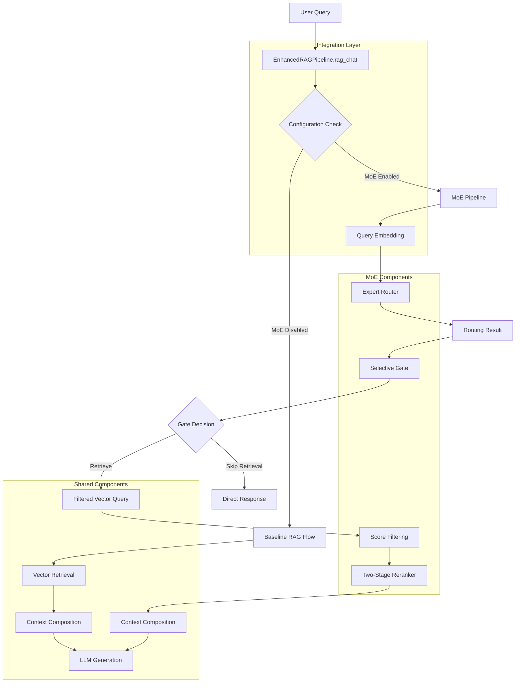

# MoE Integration Specification

## Document Information
- **Document ID:** MOE-INTEGRATION-SPEC-001
- **Version:** 1.0.0
- **Created:** 2025-08-30
- **Last Updated:** 2025-08-30
- **Status:** Draft

## Overview

This specification defines how the Mixture of Experts (MoE) components integrate with the existing RAG pipeline, ensuring seamless operation while providing enhanced retrieval capabilities. The integration maintains backward compatibility and provides configurable feature toggles.

## 1. Integration Architecture

### 1.1 Pipeline Integration Points



### 1.2 Integration Patterns

**Pattern: Decorator Pattern for RAG Enhancement**
```python
class EnhancedRAGPipeline:
    """Enhanced RAG pipeline with optional MoE integration"""

    def __init__(self, config: AppConfig):
        self.config = config
        self.embedder = get_embedder(config.EMBED_MODEL)

        # Initialize MoE components if enabled
        if config.moe.enabled:
            self._initialize_moe_components()
        else:
            self.router = None
            self.gate = None
            self.reranker = None

    def rag_chat(self, message: str, history: List[Tuple[str, str]]) -> str:
        """Main entry point - enhanced with MoE when enabled"""
        if self._should_use_moe():
            return self._moe_rag_chat(message, history)
        else:
            return self._baseline_rag_chat(message, history)
```

**Pattern: Feature Toggle Integration**
```python
def _should_use_moe(self) -> bool:
    """Determine if MoE should be used for current request"""
    return (
        self.config.moe.enabled and
        self._all_components_healthy() and
        not self._force_baseline_mode()
    )
```

## 2. Component Integration Details

### 2.1 Expert Router Integration

**Integration Point: Query Processing**

```python
def _integrate_expert_router(
    self,
    query_embedding: np.ndarray
) -> Tuple[List[str], Dict[str, float]]:
    """
    Integrate expert router into query processing pipeline.

    Integration Responsibilities:
    1. Provide query embedding to router
    2. Handle router failures gracefully
    3. Return routing results for downstream use
    4. Update router centroids if needed

    Args:
        query_embedding: Query vector from embedder

    Returns:
        Tuple of (chosen_experts, routing_similarities)
    """

    if not self.router:
        return None, {}

    try:
        chosen_experts, similarities = self.router.route_query(
            query_embedding,
            top_k=self.config.moe.router.top_k_experts
        )

        # Update centroids asynchronously if needed
        if self._should_update_centroids():
            self._schedule_centroid_update()

        return chosen_experts, similarities

    except Exception as e:
        logger.warning(f"Expert router failed: {e}, falling back to baseline")
        self._record_integration_error("router", e)
        return None, {}
```

### 2.2 Selective Gate Integration

**Integration Point: Retrieval Decision**

```python
def _integrate_selective_gate(
    self,
    routing_similarities: Dict[str, float],
    query_complexity: float = 0.5
) -> Tuple[bool, int]:
    """
    Integrate selective gate for retrieval optimization.

    Integration Flow:
    1. Pass routing results to gate
    2. Analyze query complexity if needed
    3. Make retrieval decision
    4. Return decision for vector store integration

    Args:
        routing_similarities: Similarities from expert router
        query_complexity: Estimated query complexity (0-1)

    Returns:
        Tuple of (should_retrieve, optimal_k)
    """

    if not self.gate:
        return True, self.config.TOP_K

    try:
        should_retrieve, optimal_k = self.gate.should_retrieve_and_k(
            routing_similarities,
            query_complexity
        )

        self._record_gate_decision(should_retrieve, optimal_k)
        return should_retrieve, optimal_k

    except Exception as e:
        logger.warning(f"Selective gate failed: {e}, using default retrieval")
        self._record_integration_error("gate", e)
        return True, self.config.TOP_K
```

### 2.3 Two-Stage Reranker Integration

**Integration Point: Results Processing**

```python
def _integrate_two_stage_reranker(
    self,
    query: str,
    matches: List[Dict]
) -> List[Dict]:
    """
    Integrate two-stage reranker for result enhancement.

    Integration Process:
    1. Pass matches to reranker
    2. Apply cross-encoder reranking
    3. Conditionally apply LLM reranking
    4. Return enhanced results

    Args:
        query: Original user query
        matches: Retrieved matches to rerank

    Returns:
        Reranked matches with enhanced scoring
    """

    if not self.reranker:
        return matches

    try:
        reranked_matches = self.reranker.rerank(query, matches)
        self._record_reranking_stats(matches, reranked_matches)
        return reranked_matches

    except Exception as e:
        logger.warning(f"Reranker failed: {e}, using original matches")
        self._record_integration_error("reranker", e)
        return matches
```

## 3. Configuration Integration

### 3.1 YAML Configuration Schema

```yaml
# MoE Integration Configuration
moe:
  enabled: false  # Master toggle for all MoE features

  # Component-specific toggles
  router:
    enabled: true
  gate:
    enabled: true
  reranker:
    enabled: true

  # Integration settings
  integration:
    fallback_on_failure: true
    error_threshold: 0.1  # Max error rate before disabling
    performance_monitoring: true
    health_check_interval: 60  # seconds

  # Feature flags for gradual rollout
  features:
    expert_routing: true
    selective_retrieval: true
    cross_encoder_reranking: true
    llm_reranking: false  # Expensive, disabled by default
    adaptive_thresholds: false  # Experimental

# Backward compatibility
legacy_mode: false  # Force baseline behavior
```

### 3.2 Environment Variable Integration

```bash
# MoE Feature Toggles
MOE_ENABLED=false
MOE_ROUTER_ENABLED=true
MOE_GATE_ENABLED=true
MOE_RERANKER_ENABLED=true
MOE_STAGE2_ENABLED=false

# Integration Controls
MOE_FALLBACK_ON_FAILURE=true
MOE_ERROR_THRESHOLD=0.1
MOE_PERFORMANCE_MONITORING=true

# Legacy Support
LEGACY_MODE=false
```

### 3.3 Dynamic Configuration Updates

```python
def update_moe_configuration(self, new_config: Dict[str, Any]) -> bool:
    """
    Dynamically update MoE configuration without restart.

    Update Process:
    1. Validate new configuration
    2. Apply changes to running components
    3. Update component states
    4. Log configuration changes

    Args:
        new_config: New configuration values

    Returns:
        True if update successful
    """

    try:
        # Validate configuration
        validated_config = self._validate_config_update(new_config)

        # Apply component-specific updates
        if 'router' in validated_config:
            self._update_router_config(validated_config['router'])

        if 'gate' in validated_config:
            self._update_gate_config(validated_config['gate'])

        if 'reranker' in validated_config:
            self._update_reranker_config(validated_config['reranker'])

        # Update master toggle
        if 'enabled' in validated_config:
            self.config.moe.enabled = validated_config['enabled']

        logger.info(f"MoE configuration updated: {validated_config}")
        return True

    except Exception as e:
        logger.error(f"Configuration update failed: {e}")
        return False
```

## 4. Error Handling & Resilience

### 4.1 Integration Error Handling

**Strategy: Cascading Fallbacks**

```python
def _moe_rag_chat(self, message: str, history: List[Tuple[str, str]]) -> str:
    """MoE-enhanced RAG chat with comprehensive error handling"""

    try:
        # Phase 1: Query Processing
        query_embedding = self._safe_get_embedding(message)
        if query_embedding is None:
            return self._baseline_rag_chat(message, history)

        # Phase 2: Expert Routing
        chosen_experts, similarities = self._integrate_expert_router(query_embedding)

        # Phase 3: Gate Decision
        should_retrieve, optimal_k = self._integrate_selective_gate(similarities)

        if not should_retrieve:
            return self._generate_no_context_response(message)

        # Phase 4: Vector Retrieval
        matches = self._safe_vector_retrieval(query_embedding, optimal_k, chosen_experts)
        if not matches:
            return "No strong match found."

        # Phase 5: Score Filtering
        matches = self._integrate_score_filtering(matches, query_embedding)

        # Phase 6: Reranking
        matches = self._integrate_two_stage_reranker(message, matches)

        # Phase 7: Context Composition and LLM
        return self._compose_and_generate(message, matches, history)

    except Exception as e:
        logger.error(f"MoE pipeline failed: {e}")
        self._record_integration_error("pipeline", e)

        # Ultimate fallback to baseline
        return self._baseline_rag_chat(message, history)
```

### 4.2 Component Health Monitoring

```python
class ComponentHealthMonitor:
    """Monitor health of MoE components"""

    def __init__(self):
        self.component_status = {}
        self.error_counts = defaultdict(int)
        self.last_health_check = {}

    def check_component_health(self, component_name: str) -> bool:
        """Check if component is healthy"""
        if component_name not in self.component_status:
            return self._perform_health_check(component_name)

        status = self.component_status[component_name]
        last_check = self.last_health_check.get(component_name, 0)
        check_interval = self._get_check_interval(component_name)

        # Perform check if overdue
        if time.time() - last_check > check_interval:
            return self._perform_health_check(component_name)

        return status.get("healthy", False)

    def record_component_error(self, component_name: str, error: Exception):
        """Record component error for health tracking"""
        self.error_counts[component_name] += 1

        # Mark unhealthy if error rate too high
        recent_errors = self._get_recent_error_count(component_name, 300)  # 5 minutes
        if recent_errors > 5:  # Threshold
            self.component_status[component_name] = {
                "healthy": False,
                "last_error": str(error),
                "timestamp": time.time()
            }
```

## 5. Performance Integration

### 5.1 Latency Budget Allocation

| Pipeline Phase | Baseline Latency | MoE Overhead | Total Budget |
|----------------|------------------|--------------|--------------|
| Query Embedding | 100-200ms | 0ms | 200ms |
| Expert Routing | N/A | 5-15ms | 15ms |
| Gate Decision | N/A | 2-8ms | 8ms |
| Vector Retrieval | 100-500ms | 0ms | 500ms |
| Score Filtering | N/A | 5-20ms | 20ms |
| Reranking | N/A | 50-200ms | 200ms |
| Context Composition | 10-50ms | 0ms | 50ms |
| LLM Generation | 500-2000ms | 0ms | 2000ms |
| **Total** | **710-2750ms** | **62-243ms** | **2993ms** |

### 5.2 Memory Management

**Strategy: Component Memory Isolation**

```python
class MemoryManager:
    """Manage memory usage across MoE components"""

    def __init__(self, max_memory_mb: int = 1024):
        self.max_memory = max_memory_mb
        self.component_memory = {}
        self.memory_pressure = False

    def allocate_component_memory(self, component_name: str, requested_mb: int) -> int:
        """Allocate memory for component"""
        current_usage = sum(self.component_memory.values())

        if current_usage + requested_mb > self.max_memory:
            # Memory pressure - reduce allocations
            self.memory_pressure = True
            allocated = max(0, self.max_memory - current_usage - 100)  # Reserve 100MB
        else:
            allocated = requested_mb

        self.component_memory[component_name] = allocated
        return allocated

    def should_reduce_batch_size(self) -> bool:
        """Check if batch sizes should be reduced"""
        return self.memory_pressure or self._high_memory_usage()

    def _high_memory_usage(self) -> bool:
        """Check for high memory usage"""
        current_usage = sum(self.component_memory.values())
        return current_usage > self.max_memory * 0.8  # 80% threshold
```

### 5.3 Caching Integration

**Strategy: Multi-Level Caching**

```python
class IntegratedCache:
    """Integrated caching across MoE components"""

    def __init__(self):
        self.embedding_cache = {}  # Query embeddings
        self.routing_cache = {}    # Routing decisions
        self.retrieval_cache = {}  # Retrieval results
        self.reranking_cache = {}  # Reranking results

    def get_cache_key(self, component: str, inputs: Dict[str, Any]) -> str:
        """Generate cache key for component"""
        key_parts = [component]
        for k, v in sorted(inputs.items()):
            if isinstance(v, np.ndarray):
                key_parts.append(f"{k}:{hash(v.tobytes()):x}")
            else:
                key_parts.append(f"{k}:{v}")
        return "|".join(key_parts)

    def get(self, component: str, inputs: Dict[str, Any]) -> Optional[Any]:
        """Get cached result"""
        cache_key = self.get_cache_key(component, inputs)
        cache = getattr(self, f"{component}_cache", {})

        if cache_key in cache:
            cache[cache_key]["last_access"] = time.time()
            return cache[cache_key]["result"]

        return None

    def put(self, component: str, inputs: Dict[str, Any], result: Any):
        """Store result in cache"""
        cache_key = self.get_cache_key(component, inputs)
        cache = getattr(self, f"{component}_cache", {})

        cache[cache_key] = {
            "result": result,
            "timestamp": time.time(),
            "last_access": time.time()
        }

        # Cleanup old entries
        self._cleanup_cache(component)
```

## 6. Monitoring & Observability

### 6.1 Integrated Metrics Collection

```python
class MoEIntegrationMetrics:
    """Comprehensive metrics for MoE integration"""

    def __init__(self):
        self.pipeline_metrics = []
        self.component_metrics = defaultdict(list)
        self.error_metrics = defaultdict(list)
        self.performance_metrics = []

    def record_pipeline_execution(
        self,
        query_id: str,
        moe_enabled: bool,
        total_time: float,
        components_used: List[str],
        final_answer: str
    ):
        """Record complete pipeline execution"""
        self.pipeline_metrics.append({
            "query_id": query_id,
            "moe_enabled": moe_enabled,
            "total_time": total_time,
            "components_used": components_used,
            "answer_length": len(final_answer),
            "timestamp": time.time()
        })

        # Maintain bounded history
        if len(self.pipeline_metrics) > 10000:
            self.pipeline_metrics = self.pipeline_metrics[-10000:]

    def get_integration_summary(self) -> Dict[str, Any]:
        """Get comprehensive integration summary"""
        if not self.pipeline_metrics:
            return {}

        recent_executions = self.pipeline_metrics[-1000:]

        moe_executions = [e for e in recent_executions if e["moe_enabled"]]
        baseline_executions = [e for e in recent_executions if not e["moe_enabled"]]

        return {
            "total_executions": len(recent_executions),
            "moe_usage_rate": len(moe_executions) / len(recent_executions),
            "avg_moe_time": np.mean([e["total_time"] for e in moe_executions]) if moe_executions else 0,
            "avg_baseline_time": np.mean([e["total_time"] for e in baseline_executions]) if baseline_executions else 0,
            "moe_performance_gain": self._calculate_performance_gain(moe_executions, baseline_executions),
            "component_usage_stats": self._calculate_component_usage(recent_executions)
        }
```

### 6.2 Health Dashboard Integration

```python
def get_moe_health_dashboard(self) -> Dict[str, Any]:
    """Get comprehensive MoE health dashboard"""
    return {
        "overall_health": self._calculate_overall_health(),
        "component_health": {
            "router": self.router_health_monitor.get_status() if self.router else "disabled",
            "gate": self.gate_health_monitor.get_status() if self.gate else "disabled",
            "reranker": self.reranker_health_monitor.get_status() if self.reranker else "disabled"
        },
        "performance_metrics": self.metrics.get_integration_summary(),
        "configuration_status": self._get_configuration_status(),
        "error_summary": self._get_error_summary(),
        "resource_usage": self._get_resource_usage()
    }
```

## 7. Testing Integration

### 7.1 Integration Test Framework

```python
class TestMoEIntegration:

    def test_baseline_vs_moe_comparison(self):
        """Test that MoE and baseline produce reasonable results"""
        pipeline = EnhancedRAGPipeline(self.config)

        query = "What is machine learning?"

        # Test baseline mode
        self.config.moe.enabled = False
        baseline_answer = pipeline.rag_chat(query, [])

        # Test MoE mode
        self.config.moe.enabled = True
        moe_answer = pipeline.rag_chat(query, [])

        # Both should produce non-empty answers
        assert baseline_answer and moe_answer
        assert len(moe_answer) > 10  # Reasonable length

    def test_component_failure_resilience(self):
        """Test resilience to component failures"""
        pipeline = EnhancedRAGPipeline(self.config)

        # Simulate router failure
        pipeline.router = None  # Disable router

        query = "Test query"
        answer = pipeline.rag_chat(query, [])

        # Should still produce answer via fallback
        assert answer and len(answer) > 0

    def test_configuration_toggles(self):
        """Test configuration toggle functionality"""
        pipeline = EnhancedRAGPipeline(self.config)

        # Test all combinations of component toggles
        toggle_configs = [
            {"router": False, "gate": False, "reranker": False},
            {"router": True, "gate": False, "reranker": False},
            {"router": True, "gate": True, "reranker": False},
            {"router": True, "gate": True, "reranker": True}
        ]

        for config in toggle_configs:
            pipeline.update_component_toggles(config)
            answer = pipeline.rag_chat("Test query", [])
            assert answer  # Should work in all configurations

    def test_performance_regression(self):
        """Test that MoE doesn't cause significant performance regression"""
        pipeline = EnhancedRAGPipeline(self.config)

        query = "Performance test query"
        num_iterations = 50

        # Measure baseline performance
        self.config.moe.enabled = False
        baseline_times = []
        for _ in range(num_iterations):
            start = time.time()
            pipeline.rag_chat(query, [])
            baseline_times.append(time.time() - start)

        # Measure MoE performance
        self.config.moe.enabled = True
        moe_times = []
        for _ in range(num_iterations):
            start = time.time()
            pipeline.rag_chat(query, [])
            moe_times.append(time.time() - start)

        baseline_avg = np.mean(baseline_times)
        moe_avg = np.mean(moe_times)

        # MoE should not be more than 50% slower
        assert moe_avg < baseline_avg * 1.5
```

### 7.2 A/B Testing Framework

```python
class MoEABTester:
    """A/B testing framework for MoE evaluation"""

    def __init__(self):
        self.test_results = defaultdict(list)

    def run_ab_test(
        self,
        query: str,
        num_iterations: int = 100
    ) -> Dict[str, Any]:
        """Run A/B test comparing baseline vs MoE"""
        pipeline = EnhancedRAGPipeline(self.config)

        results = {"baseline": [], "moe": []}

        for i in range(num_iterations):
            # Baseline test
            self.config.moe.enabled = False
            start = time.time()
            baseline_answer = pipeline.rag_chat(query, [])
            baseline_time = time.time() - start

            results["baseline"].append({
                "answer": baseline_answer,
                "time": baseline_time,
                "iteration": i
            })

            # MoE test
            self.config.moe.enabled = True
            start = time.time()
            moe_answer = pipeline.rag_chat(query, [])
            moe_time = time.time() - start

            results["moe"].append({
                "answer": moe_answer,
                "time": moe_time,
                "iteration": i
            })

        return self._analyze_ab_results(results)

    def _analyze_ab_results(self, results: Dict[str, List]) -> Dict[str, Any]:
        """Analyze A/B test results"""
        baseline_times = [r["time"] for r in results["baseline"]]
        moe_times = [r["time"] for r in results["moe"]]

        return {
            "baseline_avg_time": np.mean(baseline_times),
            "moe_avg_time": np.mean(moe_times),
            "time_difference": np.mean(moe_times) - np.mean(baseline_times),
            "time_difference_percent": (np.mean(moe_times) - np.mean(baseline_times)) / np.mean(baseline_times) * 100,
            "baseline_std_time": np.std(baseline_times),
            "moe_std_time": np.std(moe_times),
            "sample_size": len(results["baseline"])
        }
```

## 8. Deployment & Rollout Strategy

### 8.1 Gradual Rollout Plan

**Phase 1: Component-Level Testing (Week 1-2)**
- Deploy individual MoE components
- Test each component in isolation
- Validate component health monitoring
- Establish performance baselines

**Phase 2: Integration Testing (Week 3-4)**
- Test component interactions
- Validate error handling and fallbacks
- Performance testing with realistic loads
- A/B testing against baseline

**Phase 3: Limited Production Rollout (Week 5-6)**
- Enable MoE for 10% of queries
- Monitor performance and error rates
- Validate quality improvements
- Prepare rollback procedures

**Phase 4: Full Production Rollout (Week 7+)**
- Enable MoE for all queries
- Monitor long-term performance
- Optimize based on production data
- Plan future enhancements

### 8.2 Rollback Procedures

```python
def emergency_rollback(self) -> bool:
    """Emergency rollback to baseline RAG"""
    try:
        # Disable all MoE features
        self.config.moe.enabled = False

        # Reset component states
        self.router = None
        self.gate = None
        self.reranker = None

        # Clear caches
        self.cache.clear()

        # Log rollback
        logger.warning("Emergency rollback to baseline RAG executed")

        return True

    except Exception as e:
        logger.error(f"Emergency rollback failed: {e}")
        return False
```

### 8.3 Feature Flag Management

```python
def manage_feature_rollout(self, feature_name: str, percentage: float):
    """Manage gradual rollout of MoE features"""
    if feature_name == "moe":
        self.config.moe.enabled = percentage >= random.random() * 100
    elif feature_name == "router":
        self.config.moe.router.enabled = percentage >= random.random() * 100
    elif feature_name == "gate":
        self.config.moe.gate.enabled = percentage >= random.random() * 100
    elif feature_name == "reranker":
        self.config.moe.reranker.enabled = percentage >= random.random() * 100
```

## 9. Future Integration Enhancements

### 9.1 Advanced Integration Patterns

**Event-Driven Integration**: Publish MoE events for external monitoring
**Microservices Integration**: Separate MoE components into microservices
**Plugin Architecture**: Support for third-party MoE components
**API Gateway Integration**: Expose MoE capabilities via REST API

### 9.2 Scalability Improvements

**Horizontal Scaling**: Distribute MoE components across multiple instances
**Load Balancing**: Intelligent distribution of queries based on component load
**Auto-Scaling**: Automatic scaling of MoE components based on demand
**Geographic Distribution**: Deploy MoE components closer to users

### 9.3 Intelligence Enhancements

**Online Learning**: Continuous improvement based on user interactions
**Personalization**: User-specific MoE adaptations
**Context Awareness**: Integration with user context and preferences
**Multi-Modal Support**: Extend MoE to handle different content types

This integration specification provides the foundation for seamlessly incorporating MoE capabilities into the existing RAG system while maintaining reliability, performance, and backward compatibility.